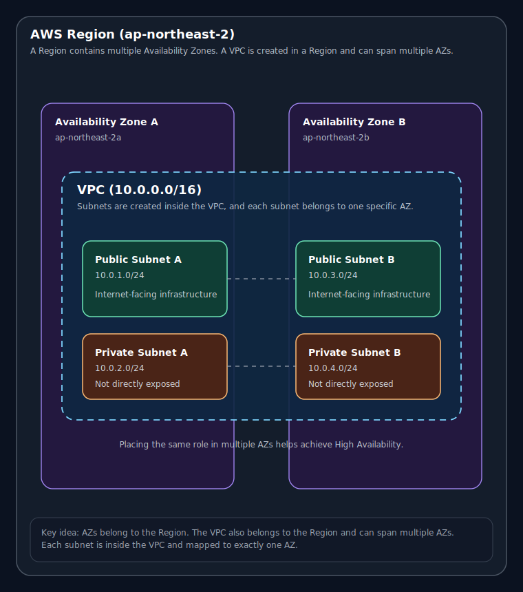

> **작성일:** 2026-04-16 | **수정일:** 2026-04-16
# Subnet이란?

서브넷(Subnet)은 VPC 내부의 IP 주소 범위를 더 작은 네트워크 단위로 나눈 것입니다. VPC가 전체 주소 범위를 가지고 있다면, 각 서브넷은 그중 일부를 나누어 갖습니다. 이때 서브넷끼리 주소 범위는 서로 겹치면 안 됩니다. 또한 모든 서브넷의 주소 범위를 합쳐도 VPC의 주소 범위 안에 있어야 합니다. 다만 VPC의 주소 범위 중 일부는 아직 어떤 서브넷에도 할당되지 않을 수 있으므로, 서브넷 전체 주소 범위를 합친 값이 VPC의 주소 범위와 정확히 같지는 않을 수 있습니다.

## Subnet이 왜 필요한가요?

서브넷은 서로 다른 용도의 인프라를 분리하고, 고가용성을 확보하기 위해 필요합니다. 예를 들어, 어떤 서브넷은 외부 인터넷과 통신해야 하는 인프라를 위한 공간으로 사용되고, 다른 서브넷은 외부 인터넷에 직접 노출되어서는 안 되는 인프라를 위한 공간으로 사용됩니다. 또한 동일한 역할의 인프라를 여러 서브넷에 나누어 배치하면, 특정 가용 영역에 장애가 발생하더라도 다른 서브넷의 인프라가 계속해서 서비스를 제공할 수 있습니다. 물론 이 외에도 서브넷을 나누는 세부적인 이유는 있지만, 본질적으로는 이 두 가지가 가장 핵심적입니다.

### 가용 영역(AZ)은 무엇인가요?

서브넷은 특정 가용 영역(AZ, Availability Zone)에 속합니다. 따라서 서브넷을 이해하려면 먼저 가용 영역이 무엇인지 알아야 합니다.

가용 영역을 이해하려면 먼저 리전(Region)부터 알아야 합니다. 리전은 AWS가 특정 지역에 구축한 물리적 인프라의 집합입니다. 예를 들어 서울 리전은 `ap-northeast-2`, 도쿄 리전은 `ap-northeast-1`, 버지니아 북부 리전은 `us-east-1`입니다.

가용 영역은 리전을 구성하는 여러 개의 독립된 인프라 단위 중 하나입니다. 하나의 리전은 일반적으로 여러 개의 가용 영역으로 이루어져 있습니다. AWS가 리전을 이렇게 여러 가용 영역으로 나누어 두는 이유는, 한 가용 영역에 장애가 발생하더라도 다른 가용 영역에서 서비스가 계속 동작할 수 있도록 하기 위해서입니다. 이것이 바로 고가용성(High Availability)입니다.

따라서 보통은 하나의 VPC 안에서 여러 가용 영역에 서브넷을 만들고, 같은 역할의 인프라를 여러 가용 영역에 분산 배치하는 방식으로 시스템을 구성합니다.

**리전과 AZ의 관계 다이어그램**

## Public Subnet과 Private Subnet은 무엇인가요?

앞서 언급했듯이, 서브넷마다 배치되는 인프라의 성격은 다를 수 있습니다. 어떤 서브넷에는 외부 인터넷과 통신해야 하는 인프라가 배치되고, 어떤 서브넷에는 외부 인터넷에 직접 노출되어서는 안 되는 인프라가 배치됩니다. 일반적으로 전자를 퍼블릭 서브넷(Public Subnet), 후자를 프라이빗 서브넷(Private Subnet)이라고 합니다.

### Public Subnet

퍼블릭 서브넷은 VPC 내부에서 외부 인터넷과 직접 통신해야 하는 인프라가 배치되는 서브넷입니다. 애플리케이션 사용자의 요청을 직접 받는 인프라는 외부에서 접근할 수 있어야 하므로, 퍼블릭 서브넷에는 공인 IP를 가지거나 외부에서 접근 가능한 인프라가 주로 배치됩니다.

### Private Subnet

프라이빗 서브넷은 외부 인터넷에 직접 노출되어서는 안 되는 인프라를 배치하는 서브넷입니다. 이러한 인프라는 외부에 노출될 경우 민감한 정보가 유출되거나 공격 대상이 될 수 있습니다. 따라서 프라이빗 서브넷의 인프라는 외부 인터넷에 자신을 직접 공개하지 않은 상태에서, 필요한 통신만 수행하는 방식으로 운영됩니다.

간단히 정리하자면, 퍼블릭 서브넷에는 외부 인터넷에서 접근 가능한 인프라가 배치되고, 프라이빗 서브넷에는 외부 인터넷에 노출되어서는 안 되는 인프라가 배치됩니다.

이하는 VPC, AZ와 서브넷이 표현된 다이어그램입니다.

