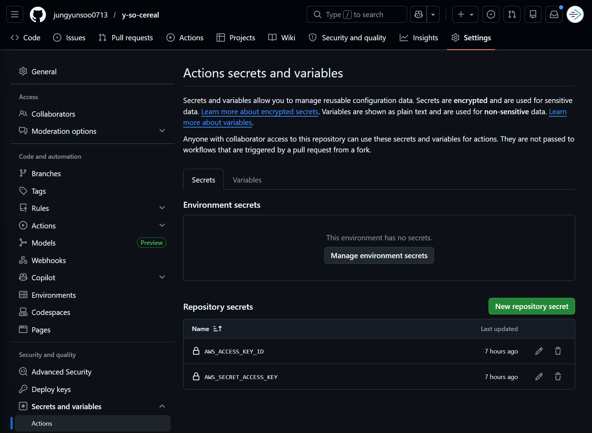
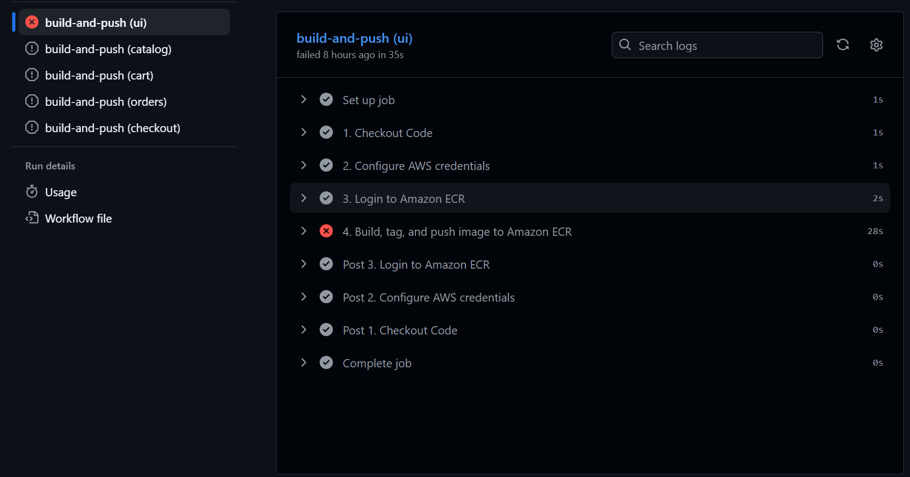
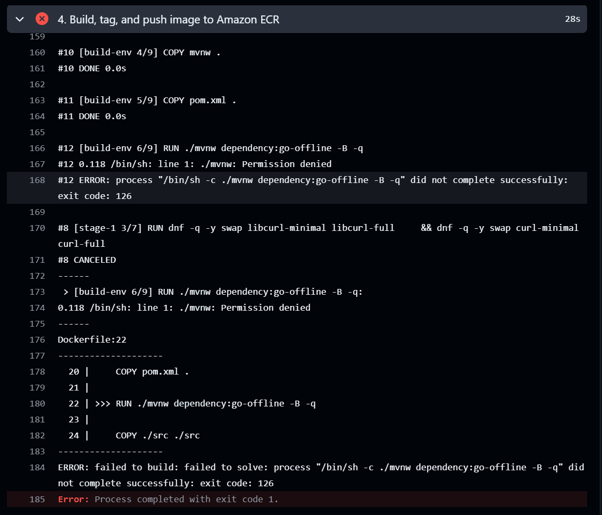
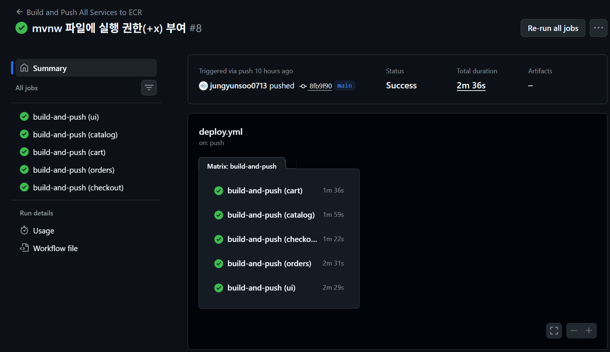

세부 사항에 신경 쓰지 않고 일단 빠르게 테라폼으로 ECS 기반 애플리케이션(Retail Store Sample App)을 구축한 뒤에 GitHub Actions CI/CD를 적용합니다.

---

`main.tf` 를 작성하여 AWS 인프라를 구축합니다. VPC, IGW, Public Subnets x 2, Route Table, Route Table Association x 2, ECR Repository x 6(assets, cart, catalog, checkout, orders, ui), ECS Cluster, ECS Task Security Group, `aws_service_discovery_private_dns_namespace.internal` 까지 총 16개의 리소스를 생성합니다. 

`main.tf`

```bash
provider "aws" {
  region = "ap-northeast-2" # 서울 리전
}

locals {
  # 띄워야 할 핵심 마이크로서비스 목록 (필요시 더 추가해!)
  services = ["ui", "catalog", "cart", "orders", "checkout", "assets"]
  vpc_cidr = "10.0.0.0/16"
}

# --------------------------------------------------
# 1. VPC & 네트워크 (빠른 통신을 위해 전부 Public Subnet)
# --------------------------------------------------
resource "aws_vpc" "main" {
  cidr_block           = local.vpc_cidr
  enable_dns_support   = true
  enable_dns_hostnames = true
  tags = { Name = "retail-vpc" }
}

resource "aws_internet_gateway" "igw" {
  vpc_id = aws_vpc.main.id
}

resource "aws_subnet" "public" {
  count                   = 2
  vpc_id                  = aws_vpc.main.id
  cidr_block              = cidrsubnet(local.vpc_cidr, 8, count.index)
  availability_zone       = element(["ap-northeast-2a", "ap-northeast-2c"], count.index)
  map_public_ip_on_launch = true # 컨테이너에 Public IP 자동 할당 (NAT Gateway 비용/시간 절약)
  tags = { Name = "retail-public-subnet-${count.index + 1}" }
}

resource "aws_route_table" "public" {
  vpc_id = aws_vpc.main.id
  route {
    cidr_block = "0.0.0.0/0"
    gateway_id = aws_internet_gateway.igw.id
  }
}

resource "aws_route_table_association" "public" {
  count          = 2
  subnet_id      = aws_subnet.public[count.index].id
  route_table_id = aws_route_table.public.id
}

# --------------------------------------------------
# 2. 공통 보안 그룹 (개판 오분전 룰 적용: 내부 완전 개방)
# --------------------------------------------------
resource "aws_security_group" "ecs_sg" {
  name        = "retail-ecs-sg"
  description = "Allow internal traffic and outbound"
  vpc_id      = aws_vpc.main.id

  # 자기 자신(같은 SG를 가진 서비스)끼리는 모든 포트 통신 허용 (핵심!)
  ingress {
    from_port = 0
    to_port   = 0
    protocol  = "-1"
    self      = true 
  }
  
  # UI 접속을 위한 80포트 오픈
  ingress {
    from_port   = 80
    to_port     = 80
    protocol    = "tcp"
    cidr_blocks = ["0.0.0.0/0"]
  }

  egress {
    from_port   = 0
    to_port     = 0
    protocol    = "-1"
    cidr_blocks = ["0.0.0.0/0"]
  }
}

# --------------------------------------------------
# 3. ECS 클러스터 & Cloud Map (마이크로서비스용 내비게이션)
# --------------------------------------------------
resource "aws_ecs_cluster" "main" {
  name = "retail-cluster"
}

# 각 서비스가 "http://catalog.retail.local" 처럼 통신할 수 있게 해줌
resource "aws_service_discovery_private_dns_namespace" "internal" {
  name        = "retail.local"
  description = "Service discovery for retail sample app"
  vpc         = aws_vpc.main.id
}

# --------------------------------------------------
# 4. ECR 저장소 (for_each로 한 방에 찍어내기)
# --------------------------------------------------
resource "aws_ecr_repository" "services" {
  for_each             = toset(local.services)
  name                 = "retail-${each.key}"
  image_tag_mutability = "MUTABLE"
  force_delete         = true # 이미지가 있어도 강제 삭제되도록 올바른 속성으로 수정!
}
```

`terraform init` 로 테라폼 실행 환경을 만들어주고 `terraform apply`로 실제 인프라를 배포할 수 있습니다. 

---

`terraform apply` 명령어를 실행하기 전에 `.gitingore`파일을 생성하여 깃 허브에 올라가면 안되는 리소스를 명시합니다. 

```gitignore
# --------------------------------------------------
# Terraform 파일 (절대 깃허브에 올라가면 안 됨!)
# --------------------------------------------------
# Local .terraform directories
**/.terraform/*

# .tfstate files (현재 인프라 상태와 민감한 데이터 포함)
*.tfstate
*.tfstate.*

# Crash log files
crash.log
crash.*.log

# Exclude all .tfvars files (AWS 키, 비밀번호 등 변수값 포함)
*.tfvars
*.tfvars.json

# Ignore override files
override.tf
override.tf.json
*_override.tf
*_override.tf.json

# Ignore CLI configuration files
.terraformrc
terraform.rc

# --------------------------------------------------
# OS 및 IDE (에디터) 공통 찌꺼기 파일
# --------------------------------------------------
.DS_Store
.vscode/
.idea/
*.swp
*.swo
```

`.tfstate` 파일은 민감한 정보를 포함한 현재 인프라를 보여주기 때문에 제외합니다.
`crash.log`, `crash.*.log` 파일은 테라폼이 실행중에 비정상적으로 죽었을 때 로그를 보여주는 파일로 악용되거나 민감한 정보를 포함 할 수 있기 때문에 제외합니다.
`.tfvars`, `.tfvars.json`은 테라폼 변수에 실제 값을 넣기 때문에 민감한 정보들이 포함될 수 있습니다. 따라서 제외합니다.
`override.tf`, `override.tf.json`, `*_override.tf`, `*_override.tf.json` 등은 개인 로컬 환경에서 기존의 코드를 덮어 씌우기 때문에 제외합니다. 역시 민감한 정보들이 포함될 수 있습니다.
`.terraformrc`, `terraform.rc`는 테라폼 CLI 설정 파일입니다. 로컬 테라폼 CLI 설정값(토큰, 인증 정보 등)이 들어갈 수 있기 때문에 제외합니다.

`.gitignore` 파일의 작성이 끝났다면, `terraform apply` 명령어를 실행하여 인프라를 배포하고 깃 허브에 코드를 푸시합니다.

---

GitHub Actions 파일인 `deploy.yml`을 작성합니다. `.github/workflows`에 위치시킵니다.

```yml
name: Build and Push All Services to ECR

on:
  push:
    branches:
      - main # main 브랜치에 코드가 푸시되면 자동 실행
  workflow_dispatch: # GitHub 웹에서 수동으로 버튼 눌러서 실행할 수 있는 옵션 (테스트할 때 꿀기능!)

env:
  AWS_REGION: ap-northeast-2 # 본인이 Terraform에서 설정한 리전과 동일하게 맞출 것

jobs:
  build-and-push:
    runs-on: ubuntu-latest
    
    # 💡 핵심: matrix를 쓰면 아래 배열에 있는 서비스 개수만큼 작업을 동시에 병렬로 실행함!
    strategy:
      matrix:
        service: [ui, catalog, cart, orders, checkout]

    steps:
      - name: 1. Checkout Code
        uses: actions/checkout@v3

      - name: 2. Configure AWS credentials
        uses: aws-actions/configure-aws-credentials@v2
        with:
          aws-access-key-id: ${{ secrets.AWS_ACCESS_KEY_ID }}
          aws-secret-access-key: ${{ secrets.AWS_SECRET_ACCESS_KEY }}
          aws-region: ${{ env.AWS_REGION }}

      - name: 3. Login to Amazon ECR
        id: login-ecr
        uses: aws-actions/amazon-ecr-login@v1

      - name: 4. Build, tag, and push image to Amazon ECR
        env:
          ECR_REGISTRY: ${{ steps.login-ecr.outputs.registry }}
          ECR_REPOSITORY: retail-${{ matrix.service }}
          IMAGE_TAG: latest # 원래는 ${{ github.sha }} 같은 해시값을 쓰지만, 개판 오분전 전략이므로 latest로 덮어쓰기!
        # 앱 소스코드가 src/ui, src/catalog 폴더 안에 있다고 가정
        run: |
          cd src/${{ matrix.service }}
          docker build -t $ECR_REGISTRY/$ECR_REPOSITORY:$IMAGE_TAG .
          docker push $ECR_REGISTRY/$ECR_REPOSITORY:$IMAGE_TAG
```

`main` 브랜치에 코드를 푸시할 때마다 깃 허브 액션즈가 자동으로 실행됩니다. 코드를 푸시했는데, AWS 인증 정보가 등록되지 않았기 때문에, 깃 허브 액션즈 워크플로우가 실패했습니다. 인증 정보를 등록합니다. 



---

또한 `assets` 서비스는 존재하지 않기 때문에 `main.tf`와 `deploy.yml`에서 지워줍니다. 

`main.tf`

```hcl

...

locals {
  # 띄워야 할 핵심 마이크로서비스 목록 (필요시 더 추가해!)
  services = ["ui", "catalog", "cart", "orders", "checkout"]
  vpc_cidr = "10.0.0.0/16"
}

...

```

`deploy.yml`

```yml

...

    strategy:
      matrix:
        service: [ui, catalog, cart, orders, checkout]
        
...

```

---

`main`브랜치에 코드를 푸시 했지만 깃 허브 액션즈 워크플로우가 다시 실패했습니다





`./mvnw: Permission denied`는 `mvnw` 파일을 실행하려고 했는데, 실행 권한이 없어서 막혔다는 것을 의미합니다. 샘플 앱의 일부 서비스는(`UI`, `Cart`, `Orders` )은 자바(Java)로 짜여 있고, 이걸 빌드하기 위해 `mvnw` (Maven Wrapper)라는 실행 파일을 사용합니다.

|Component|Language|Description|
|---|---|---|
|UI|Java|Store user interface|
|Catalog|Go|Product catalog API|
|Cart|Java|User shopping carts API|
|Orders|Java|User orders API|
|Checkout|Node.js|API to orchestrate the checkout process|

코드를 복사하거나 깃허브로 올리는 과정에서, `mvnw` 파일이 가지고 있던 '실행 권한(Executable Permission)'이 날아가 버렸을 수도 있습니다. 따라서 git 명령어를 통해 실행 권한을 다시 부여합니다. `Catalog`, `Checkout`은 자바로 작성되어있지 않기 때문에 나머지 3개의 서비스에만 실행 권한이 부여됩니다. 

```bash
young@young:~/y-so-cereal$ git update-index --chmod=+x src/ui/mvnw
git update-index --chmod=+x src/catalog/mvnw
git update-index --chmod=+x src/cart/mvnw
git update-index --chmod=+x src/orders/mvnw
git update-index --chmod=+x src/checkout/mvnw
error: src/catalog/mvnw: does not exist and --remove not passed
fatal: Unable to process path src/catalog/mvnw
error: src/checkout/mvnw: does not exist and --remove not passed
fatal: Unable to process path src/checkout/mvnw
```

`mvnw` 실행 권한 변경이 완료 되었습니다. 다시 `main` 브랜치에 코드를 푸시했더니 깃 허브 액션즈 워크플로우가 성공했습니다. 

```bash
young@young:~/y-so-cereal$ git commit -m "mvnw 파일에 실행 권한(+x) 부여"
git push
[main 8fb9f90] mvnw 파일에 실행 권한(+x) 부여
 3 files changed, 0 insertions(+), 0 deletions(-)
 mode change 100644 => 100755 src/cart/mvnw
 mode change 100644 => 100755 src/orders/mvnw
 mode change 100644 => 100755 src/ui/mvnw
Enumerating objects: 11, done.
Counting objects: 100% (11/11), done.
Delta compression using up to 8 threads
Compressing objects: 100% (6/6), done.
Writing objects: 100% (6/6), 534 bytes | 534.00 KiB/s, done.
Total 6 (delta 5), reused 0 (delta 0), pack-reused 0
remote: Resolving deltas: 100% (5/5), completed with 5 local objects.
To https://github.com/jungyunsoo0713/y-so-cereal.git
   790560f..8fb9f90  main -> main
```



---

지금까지 테라폼 파일인 `main.tf`를 활용하여 AWS 기본 인프라와 ECS 클러스터 뼈대를 구축하였습니다. 이후 깃허브 액션즈를 이용해 CI/CD 파이프라인을 구성하고, 5개의 마이크로서비스 도커 이미지를 빌드하여 Amazon ECR에 푸시하는 작업을 완료하였습니다.

다음 단계로는 프론트엔드(`ui`) 서비스 배포를 진행합니다. `ecs-ui.tf`를 작성하여 ECR에 저장된 `ui` 이미지를 ECS Fargate에 올리고, Application Load Balancer(ALB)를 구성해 외부 인터넷 트래픽이 정상적으로 라우팅되도록 설정합니다.

---

`ecs-ui.tf` 파일을 작성합니다. 

```hcl
# --------------------------------------------------
# 1. ECS가 ECR에서 이미지를 당겨올 수 있게 권한(IAM) 부여
# --------------------------------------------------
resource "aws_iam_role" "ecs_execution_role" {
  name = "retail-ecs-execution-role"
  assume_role_policy = jsonencode({
    Version = "2012-10-17"
    Statement = [{
      Action = "sts:AssumeRole"
      Effect = "Allow"
      Principal = { Service = "ecs-tasks.amazonaws.com" }
    }]
  })
}

resource "aws_iam_role_policy_attachment" "ecs_execution_role_policy" {
  role       = aws_iam_role.ecs_execution_role.name
  policy_arn = "arn:aws:iam::aws:policy/service-role/AmazonECSTaskExecutionRolePolicy"
}

# --------------------------------------------------
# 2. 로드밸런서(ALB) 생성 (유저가 접속할 대문)
# --------------------------------------------------
resource "aws_lb" "main" {
  name               = "retail-alb"
  internal           = false
  load_balancer_type = "application"
  security_groups    = [aws_security_group.ecs_sg.id]
  subnets            = aws_subnet.public[*].id
}

resource "aws_lb_target_group" "ui" {
  name        = "retail-ui-tg"
  port        = 8080 # 샘플 앱 UI의 기본 포트
  protocol    = "HTTP"
  vpc_id      = aws_vpc.main.id
  target_type = "ip"
}

resource "aws_lb_listener" "http" {
  load_balancer_arn = aws_lb.main.arn
  port              = "80"
  protocol          = "HTTP"
  default_action {
    type             = "forward"
    target_group_arn = aws_lb_target_group.ui.arn
  }
}

# --------------------------------------------------
# 내 AWS 계정 ID 가져오기 (ECR 주소 만들 때 필요)
# --------------------------------------------------
data "aws_caller_identity" "current" {}

# --------------------------------------------------
# 3. ECS Task & Service (진짜 컨테이너 띄우기)
# --------------------------------------------------
resource "aws_ecs_task_definition" "ui" {
  family                   = "retail-ui"
  network_mode             = "awsvpc"
  requires_compatibilities = ["FARGATE"]
  cpu                      = "256"
  memory                   = "512"
  execution_role_arn       = aws_iam_role.ecs_execution_role.arn

  container_definitions = jsonencode([{
    name  = "ui"
    image = "${data.aws_caller_identity.current.account_id}.dkr.ecr.ap-northeast-2.amazonaws.com/retail-ui:latest"
    portMappings = [{
      containerPort = 8080
      hostPort      = 8080
    }]
  }])
}

resource "aws_ecs_service" "ui" {
  name            = "retail-ui-service"
  cluster         = aws_ecs_cluster.main.id
  task_definition = aws_ecs_task_definition.ui.arn
  desired_count   = 1
  launch_type     = "FARGATE"

  network_configuration {
    subnets          = aws_subnet.public[*].id
    security_groups  = [aws_security_group.ecs_sg.id]
    assign_public_ip = true
  }

  load_balancer {
    target_group_arn = aws_lb_target_group.ui.arn
    container_name   = "ui"
    container_port   = 8080
  }
}

# --------------------------------------------------
# 4. 배포 완료 후 브라우저에 칠 주소 뱉어내기
# --------------------------------------------------
output "website_url" {
  value = "http://${aws_lb.main.dns_name}"
}
```

`terraform apply` 명령어를 실행합니다. ECR에 보관되어 있던 UI 도커 이미지를 가져와 사용자가 인터넷 브라우저로 실제 접속할 수 있는 프론트엔드(UI) 웹 서비스 환경이 최종 구축됩니다.

```bash
young@young:~/y-so-cereal$ terraform apply
data.aws_caller_identity.current: Reading...
aws_ecr_repository.services["cart"]: Refreshing state... [id=retail-cart]
aws_ecr_repository.services["orders"]: Refreshing state... [id=retail-orders]
aws_vpc.main: Refreshing state... [id=vpc-091ecab8f4cd1244f]
aws_ecs_cluster.main: Refreshing state... [id=arn:aws:ecs:ap-northeast-2:802104112480:cluster/retail-cluster]
aws_ecr_repository.services["catalog"]: Refreshing state... [id=retail-catalog]
aws_ecr_repository.services["ui"]: Refreshing state... [id=retail-ui]
aws_ecr_repository.services["checkout"]: Refreshing state... [id=retail-checkout]
data.aws_caller_identity.current: Read complete after 0s [id=802104112480]
aws_service_discovery_private_dns_namespace.internal: Refreshing state... [id=ns-xv4buc22jvjcqawo]
aws_internet_gateway.igw: Refreshing state... [id=igw-0c9b2df21ed0be47f]
aws_subnet.public[1]: Refreshing state... [id=subnet-0f52b15e7ce437465]
aws_subnet.public[0]: Refreshing state... [id=subnet-0f611b8d3d38c318d]
aws_security_group.ecs_sg: Refreshing state... [id=sg-08ab7fad4d720954a]
aws_route_table.public: Refreshing state... [id=rtb-0535f5757ad638cc3]
aws_route_table_association.public[1]: Refreshing state... [id=rtbassoc-0e7fdf08251386738]
aws_route_table_association.public[0]: Refreshing state... [id=rtbassoc-0cc2ee6252abace14]

Terraform used the selected providers to generate the following execution plan. Resource actions are indicated with the following symbols:
  + create

Terraform will perform the following actions:

  # aws_ecs_service.ui will be created
  + resource "aws_ecs_service" "ui" {
      + arn                                = (known after apply)
      + availability_zone_rebalancing      = (known after apply)
      + cluster                            = "arn:aws:ecs:ap-northeast-2:802104112480:cluster/retail-cluster"
      + deployment_maximum_percent         = 200
      + deployment_minimum_healthy_percent = 100
      + desired_count                      = 1
      + enable_ecs_managed_tags            = false
      + enable_execute_command             = false
      + iam_role                           = (known after apply)
      + id                                 = (known after apply)
      + launch_type                        = "FARGATE"
      + name                               = "retail-ui-service"
      + platform_version                   = (known after apply)
      + region                             = "ap-northeast-2"
      + scheduling_strategy                = "REPLICA"
      + tags_all                           = (known after apply)
      + task_definition                    = (known after apply)
      + triggers                           = (known after apply)
      + wait_for_steady_state              = false

      + deployment_configuration (known after apply)

      + load_balancer {
          + container_name   = "ui"
          + container_port   = 8080
          + target_group_arn = (known after apply)
            # (1 unchanged attribute hidden)
        }

      + network_configuration {
          + assign_public_ip = true
          + security_groups  = [
              + "sg-08ab7fad4d720954a",
            ]
          + subnets          = [
              + "subnet-0f52b15e7ce437465",
              + "subnet-0f611b8d3d38c318d",
            ]
        }
    }

  # aws_ecs_task_definition.ui will be created
  + resource "aws_ecs_task_definition" "ui" {
      + arn                      = (known after apply)
      + arn_without_revision     = (known after apply)
      + container_definitions    = jsonencode(
            [
              + {
                  + image        = "802104112480.dkr.ecr.ap-northeast-2.amazonaws.com/retail-ui:latest"
                  + name         = "ui"
                  + portMappings = [
                      + {
                          + containerPort = 8080
                          + hostPort      = 8080
                        },
                    ]
                },
            ]
        )
      + cpu                      = "256"
      + enable_fault_injection   = (known after apply)
      + execution_role_arn       = (known after apply)
      + family                   = "retail-ui"
      + id                       = (known after apply)
      + memory                   = "512"
      + network_mode             = "awsvpc"
      + region                   = "ap-northeast-2"
      + requires_compatibilities = [
          + "FARGATE",
        ]
      + revision                 = (known after apply)
      + skip_destroy             = false
      + tags_all                 = (known after apply)
      + track_latest             = false
    }

  # aws_iam_role.ecs_execution_role will be created
  + resource "aws_iam_role" "ecs_execution_role" {
      + arn                   = (known after apply)
      + assume_role_policy    = jsonencode(
            {
              + Statement = [
                  + {
                      + Action    = "sts:AssumeRole"
                      + Effect    = "Allow"
                      + Principal = {
                          + Service = "ecs-tasks.amazonaws.com"
                        }
                    },
                ]
              + Version   = "2012-10-17"
            }
        )
      + create_date           = (known after apply)
      + force_detach_policies = false
      + id                    = (known after apply)
      + managed_policy_arns   = (known after apply)
      + max_session_duration  = 3600
      + name                  = "retail-ecs-execution-role"
      + name_prefix           = (known after apply)
      + path                  = "/"
      + tags_all              = (known after apply)
      + unique_id             = (known after apply)

      + inline_policy (known after apply)
    }

  # aws_iam_role_policy_attachment.ecs_execution_role_policy will be created
  + resource "aws_iam_role_policy_attachment" "ecs_execution_role_policy" {
      + id         = (known after apply)
      + policy_arn = "arn:aws:iam::aws:policy/service-role/AmazonECSTaskExecutionRolePolicy"
      + role       = "retail-ecs-execution-role"
    }

  # aws_lb.main will be created
  + resource "aws_lb" "main" {
      + arn                                                          = (known after apply)
      + arn_suffix                                                   = (known after apply)
      + client_keep_alive                                            = 3600
      + desync_mitigation_mode                                       = "defensive"
      + dns_name                                                     = (known after apply)
      + drop_invalid_header_fields                                   = false
      + enable_deletion_protection                                   = false
      + enable_http2                                                 = true
      + enable_tls_version_and_cipher_suite_headers                  = false
      + enable_waf_fail_open                                         = false
      + enable_xff_client_port                                       = false
      + enable_zonal_shift                                           = false
      + enforce_security_group_inbound_rules_on_private_link_traffic = (known after apply)
      + id                                                           = (known after apply)
      + idle_timeout                                                 = 60
      + internal                                                     = false
      + ip_address_type                                              = (known after apply)
      + load_balancer_type                                           = "application"
      + name                                                         = "retail-alb"
      + name_prefix                                                  = (known after apply)
      + preserve_host_header                                         = false
      + region                                                       = "ap-northeast-2"
      + secondary_ips_auto_assigned_per_subnet                       = (known after apply)
      + security_groups                                              = [
          + "sg-08ab7fad4d720954a",
        ]
      + subnets                                                      = [
          + "subnet-0f52b15e7ce437465",
          + "subnet-0f611b8d3d38c318d",
        ]
      + tags_all                                                     = (known after apply)
      + vpc_id                                                       = (known after apply)
      + xff_header_processing_mode                                   = "append"
      + zone_id                                                      = (known after apply)

      + subnet_mapping (known after apply)
    }

  # aws_lb_listener.http will be created
  + resource "aws_lb_listener" "http" {
      + arn                                                                   = (known after apply)
      + id                                                                    = (known after apply)
      + load_balancer_arn                                                     = (known after apply)
      + port                                                                  = 80
      + protocol                                                              = "HTTP"
      + region                                                                = "ap-northeast-2"
      + routing_http_request_x_amzn_mtls_clientcert_header_name               = (known after apply)
      + routing_http_request_x_amzn_mtls_clientcert_issuer_header_name        = (known after apply)
      + routing_http_request_x_amzn_mtls_clientcert_leaf_header_name          = (known after apply)
      + routing_http_request_x_amzn_mtls_clientcert_serial_number_header_name = (known after apply)
      + routing_http_request_x_amzn_mtls_clientcert_subject_header_name       = (known after apply)
      + routing_http_request_x_amzn_mtls_clientcert_validity_header_name      = (known after apply)
      + routing_http_request_x_amzn_tls_cipher_suite_header_name              = (known after apply)
      + routing_http_request_x_amzn_tls_version_header_name                   = (known after apply)
      + routing_http_response_access_control_allow_credentials_header_value   = (known after apply)
      + routing_http_response_access_control_allow_headers_header_value       = (known after apply)
      + routing_http_response_access_control_allow_methods_header_value       = (known after apply)
      + routing_http_response_access_control_allow_origin_header_value        = (known after apply)
      + routing_http_response_access_control_expose_headers_header_value      = (known after apply)
      + routing_http_response_access_control_max_age_header_value             = (known after apply)
      + routing_http_response_content_security_policy_header_value            = (known after apply)
      + routing_http_response_server_enabled                                  = (known after apply)
      + routing_http_response_strict_transport_security_header_value          = (known after apply)
      + routing_http_response_x_content_type_options_header_value             = (known after apply)
      + routing_http_response_x_frame_options_header_value                    = (known after apply)
      + ssl_policy                                                            = (known after apply)
      + tags_all                                                              = (known after apply)
      + tcp_idle_timeout_seconds                                              = (known after apply)

      + default_action {
          + order            = (known after apply)
          + target_group_arn = (known after apply)
          + type             = "forward"
        }

      + mutual_authentication (known after apply)
    }

  # aws_lb_target_group.ui will be created
  + resource "aws_lb_target_group" "ui" {
      + arn                                = (known after apply)
      + arn_suffix                         = (known after apply)
      + connection_termination             = (known after apply)
      + deregistration_delay               = "300"
      + id                                 = (known after apply)
      + ip_address_type                    = (known after apply)
      + lambda_multi_value_headers_enabled = false
      + load_balancer_arns                 = (known after apply)
      + load_balancing_algorithm_type      = (known after apply)
      + load_balancing_anomaly_mitigation  = (known after apply)
      + load_balancing_cross_zone_enabled  = (known after apply)
      + name                               = "retail-ui-tg"
      + name_prefix                        = (known after apply)
      + port                               = 8080
      + preserve_client_ip                 = (known after apply)
      + protocol                           = "HTTP"
      + protocol_version                   = (known after apply)
      + proxy_protocol_v2                  = false
      + region                             = "ap-northeast-2"
      + slow_start                         = 0
      + tags_all                           = (known after apply)
      + target_type                        = "ip"
      + vpc_id                             = "vpc-091ecab8f4cd1244f"

      + health_check (known after apply)

      + stickiness (known after apply)

      + target_failover (known after apply)

      + target_group_health (known after apply)

      + target_health_state (known after apply)
    }

Plan: 7 to add, 0 to change, 0 to destroy.

Changes to Outputs:
  + website_url = (known after apply)

Do you want to perform these actions?
  Terraform will perform the actions described above.
  Only 'yes' will be accepted to approve.

  Enter a value: yes

aws_iam_role.ecs_execution_role: Creating...
aws_lb_target_group.ui: Creating...
aws_lb.main: Creating...
aws_lb_target_group.ui: Creation complete after 1s [id=arn:aws:elasticloadbalancing:ap-northeast-2:802104112480:targetgroup/retail-ui-tg/f0acc0c4ac88dfb6]
aws_iam_role.ecs_execution_role: Creation complete after 2s [id=retail-ecs-execution-role]
aws_iam_role_policy_attachment.ecs_execution_role_policy: Creating...
aws_ecs_task_definition.ui: Creating...
aws_ecs_task_definition.ui: Creation complete after 0s [id=retail-ui]
aws_ecs_service.ui: Creating...
aws_iam_role_policy_attachment.ecs_execution_role_policy: Creation complete after 0s [id=retail-ecs-execution-role/arn:aws:iam::aws:policy/service-role/AmazonECSTaskExecutionRolePolicy]
aws_lb.main: Still creating... [00m10s elapsed]
aws_ecs_service.ui: Still creating... [00m10s elapsed]
aws_lb.main: Still creating... [00m19s elapsed]
aws_ecs_service.ui: Still creating... [00m19s elapsed]
aws_lb.main: Still creating... [00m29s elapsed]
aws_ecs_service.ui: Still creating... [00m29s elapsed]
aws_lb.main: Still creating... [00m39s elapsed]
aws_ecs_service.ui: Still creating... [00m39s elapsed]
aws_lb.main: Still creating... [00m48s elapsed]
aws_ecs_service.ui: Still creating... [00m48s elapsed]
aws_lb.main: Still creating... [00m58s elapsed]
aws_ecs_service.ui: Still creating... [00m58s elapsed]
aws_lb.main: Still creating... [01m08s elapsed]
aws_ecs_service.ui: Still creating... [01m08s elapsed]
aws_lb.main: Still creating... [01m17s elapsed]
aws_ecs_service.ui: Still creating... [01m17s elapsed]
aws_lb.main: Still creating... [01m27s elapsed]
aws_ecs_service.ui: Still creating... [01m27s elapsed]
aws_lb.main: Still creating... [01m37s elapsed]
aws_ecs_service.ui: Still creating... [01m37s elapsed]
aws_lb.main: Still creating... [01m47s elapsed]
aws_ecs_service.ui: Still creating... [01m46s elapsed]
aws_lb.main: Still creating... [01m56s elapsed]
aws_ecs_service.ui: Still creating... [01m56s elapsed]
aws_lb.main: Still creating... [02m06s elapsed]
aws_ecs_service.ui: Still creating... [02m06s elapsed]
aws_lb.main: Still creating... [02m16s elapsed]
aws_ecs_service.ui: Still creating... [02m16s elapsed]
aws_lb.main: Still creating... [02m26s elapsed]
aws_ecs_service.ui: Still creating... [02m26s elapsed]
aws_lb.main: Still creating... [02m36s elapsed]
aws_ecs_service.ui: Still creating... [02m36s elapsed]
aws_lb.main: Still creating... [02m46s elapsed]
aws_ecs_service.ui: Still creating... [02m46s elapsed]
aws_lb.main: Still creating... [02m55s elapsed]
aws_lb.main: Creation complete after 2m56s [id=arn:aws:elasticloadbalancing:ap-northeast-2:802104112480:loadbalancer/app/retail-alb/5cf0049969e35e3a]
aws_lb_listener.http: Creating...
aws_lb_listener.http: Creation complete after 0s [id=arn:aws:elasticloadbalancing:ap-northeast-2:802104112480:listener/app/retail-alb/5cf0049969e35e3a/29edddf4d82083ee]
aws_ecs_service.ui: Still creating... [02m55s elapsed]
aws_ecs_service.ui: Creation complete after 2m55s [id=arn:aws:ecs:ap-northeast-2:802104112480:service/retail-cluster/retail-ui-service]

Apply complete! Resources: 7 added, 0 changed, 0 destroyed.

Outputs:

website_url = "http://retail-alb-790537774.ap-northeast-2.elb.amazonaws.com"
```

다음 주소를 브라우저에 입력하면 배포한 UI 마이크로서비스 앱의 첫 화면을 확인할 수 있습니다.
`http://retail-alb-790537774.ap-northeast-2.elb.amazonaws.com`

---

**작업 요약:**

1. 기본 인프라 및 Git 설정: `main.tf` 파일로 AWS 기본 인프라를 구성하고, `.gitignore` 파일로 깃허브에 올라가면 안 될 파일을 정해줍니다.

2. CI/CD 파이프라인 구성: GitHub Actions 파일인 `deploy.yml`을 작성하여, `main` 브랜치에 코드가 푸시되면 자동으로 배포 파이프라인을 가동합니다.

3. 도커 이미지 빌드 및 푸시: 이 배포 파이프라인은 프론트엔드와 백엔드를 포함한 5개의 핵심 서비스 도커 이미지를 생성(Build)한 뒤, AWS ECR(Elastic Container Registry)에 안전하게 업로드하여 실제 서버(ECS)에 배포될 준비를 완벽하게 마칩니다.

4. UI 서비스 최종 배포: `ecs-ui.tf` 파일은 ECR에 저장된 UI 도커 이미지를 기반으로 AWS ECS(Fargate) 환경에 실제 컨테이너를 구동하고, Application Load Balancer(ALB)를 연동하여 사용자가 인터넷 브라우저로 접속할 수 있는 퍼블릭 엔드포인트를 제공합니다.

**트러블 슈팅 요약:**

이번 프로젝트를 진행하며 인프라 구축과 CI/CD 파이프라인 배포 과정에서 여러 이슈를 마주했고, 다음과 같이 원인을 분석하여 해결했습니다.

1. 소스 코드(`src`) 경로 누락으로 인한 파이프라인 실패
	- 문제: 초기에 GitHub Actions 워크플로우 실행 시, 마이크로서비스 코드가 담긴 `src/` 디렉터리를 찾지 못해 도커 이미지 빌드 단계에서 오류가 발생했습니다.
	- 해결: 누락된 `src/` 하위의 애플리케이션 코드들이 깃허브 저장소에 빠짐없이 포함(Push)되도록 경로를 확인하고 재반영하여 워크플로우를 정상화했습니다.
	
2. AWS 자격 증명(Credentials) 누락에 따른 ECR 인증 실패
    - 문제: 빌드된 도커 이미지를 AWS ECR에 Push 하는 과정에서, `configure-aws-credentials` 단계의 인증 실패로 워크플로우가 중단되었습니다.
    - 해결: AWS IAM 사용자로부터 발급받은 액세스 키(`AWS_ACCESS_KEY_ID`)와 시크릿 키(`AWS_SECRET_ACCESS_KEY`)를 GitHub Repository Secrets에 안전하게 등록하여, 파이프라인이 정상적으로 AWS 자원에 접근할 수 있도록 권한 문제를 조치했습니다.
    
3. 불필요한 리소스(`assets`) 충돌 및 빌드 오류
    - 문제: 원본 프로젝트 구조에 포함되어 있던 `assets` 디렉터리 관련 설정들로 인해 워크플로우 빌드 및 인프라 구성 단계에서 충돌이 발생했습니다.
    - 해결: 현재 배포 목표에 불필요한 파일로 판단하여, `deploy.yml`과 `main.tf`에서`assets` 관련 코드를 완전히 제거하고 인프라 구성을 단순화하여 해결했습니다.
    
4. `mvnw` 파일의 실행 권한 유실 (Permission denied)
    - 문제: 리눅스 환경인 GitHub Actions 러너에서 Java 코드를 빌드하려 할 때, Maven Wrapper(`mvnw`) 파일이 일반 텍스트 파일로 인식되어 `Permission denied` 에러가 발생했습니다.
    - 해결: 로컬 환경에서 Git으로 코드를 관리할 때 실행 권한이 누락된 것을 파악하고, 로컬 터미널에서 `git update-index --chmod=+x` 명령어를 통해 실행 권한을 강제로 부여하여 빌드 에러를 조치했습니다.
    
5. 초기 배포 직후 503 / 502 에러 발생 (애플리케이션 워밍업 지연) - 본문에서 언급 안됨
    - 문제: 프론트엔드(UI) 서비스 배포를 마치고 로드밸런서(ALB) 주소로 접속했을 때, 503 Service Temporarily Unavailable 및 502 Bad Gateway 에러가 연달아 발생했습니다.
    - 해결: 인프라나 서버의 크래시(Crash)가 아닌, 컨테이너 내부의 Java(Spring Boot) 애플리케이션이 완전히 부팅되고 헬스 체크(Health Check)에 응답하기까지 필요한 워밍업 지연 시간임을 파악했습니다. 일정 시간 대기 후 ALB와 컨테이너 간의 통신이 안정화되며 정상적인 웹사이트 접속에 성공했습니다.

