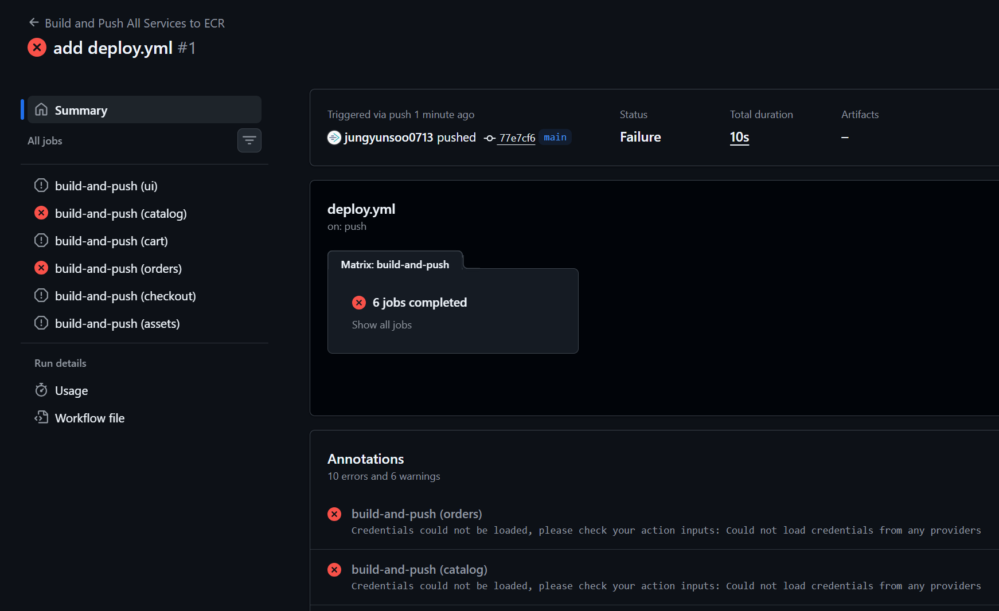
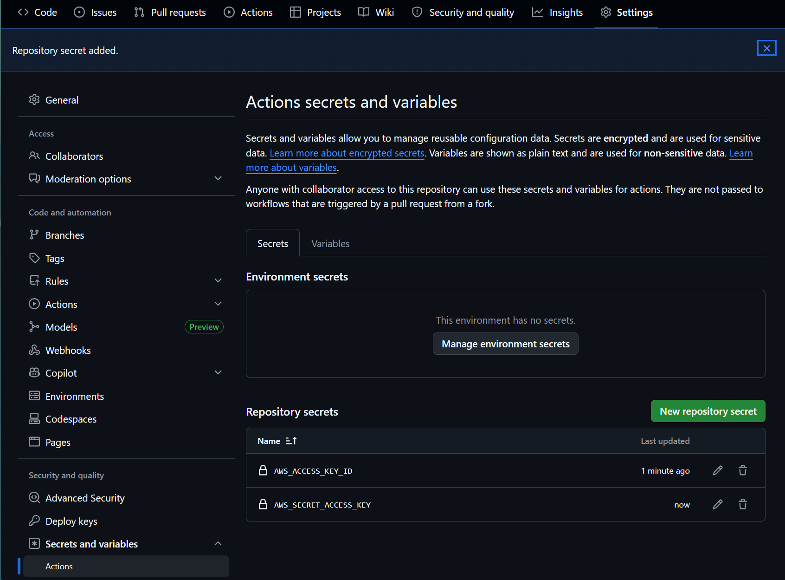
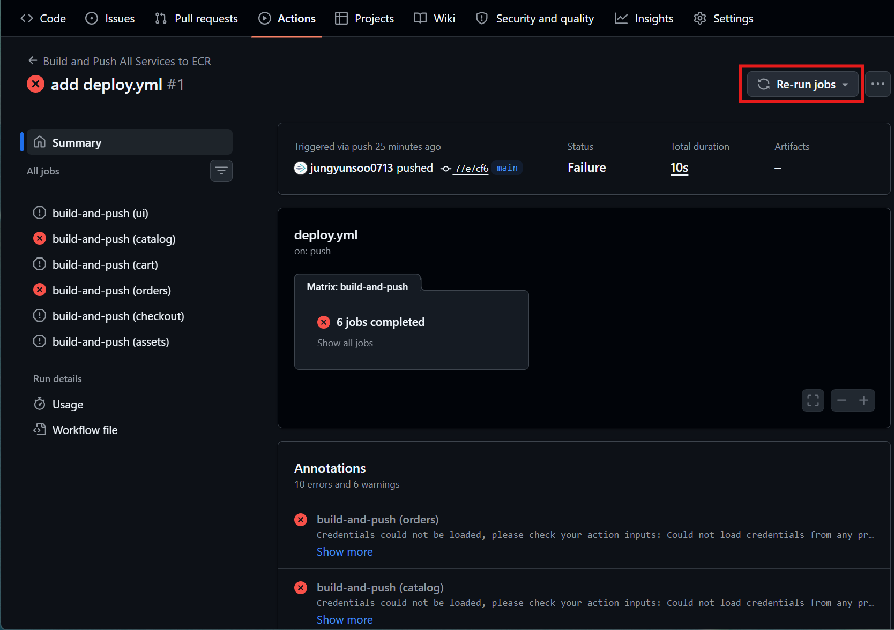
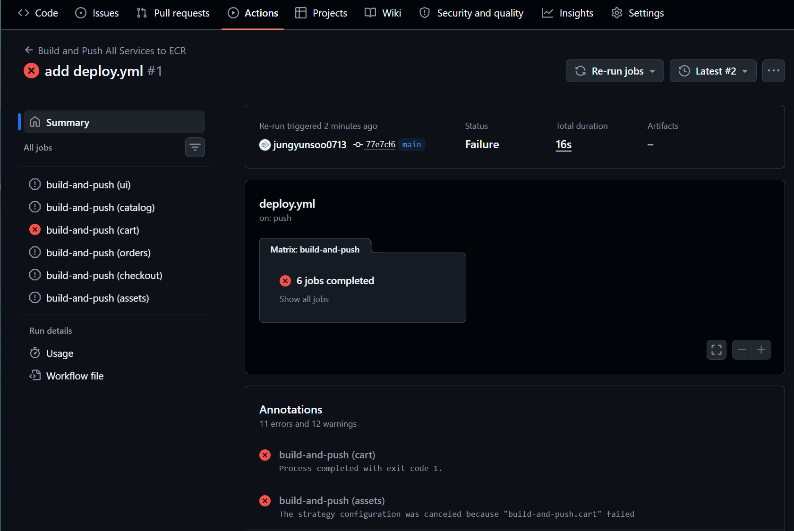
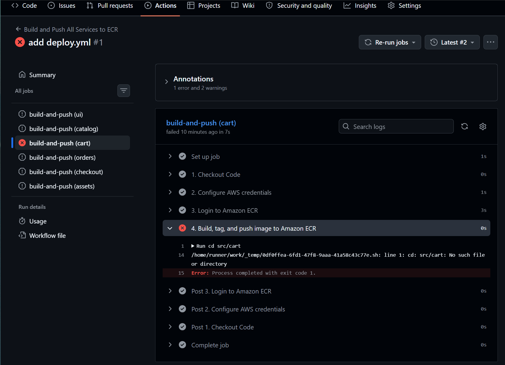
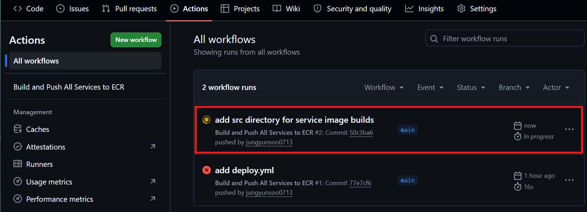
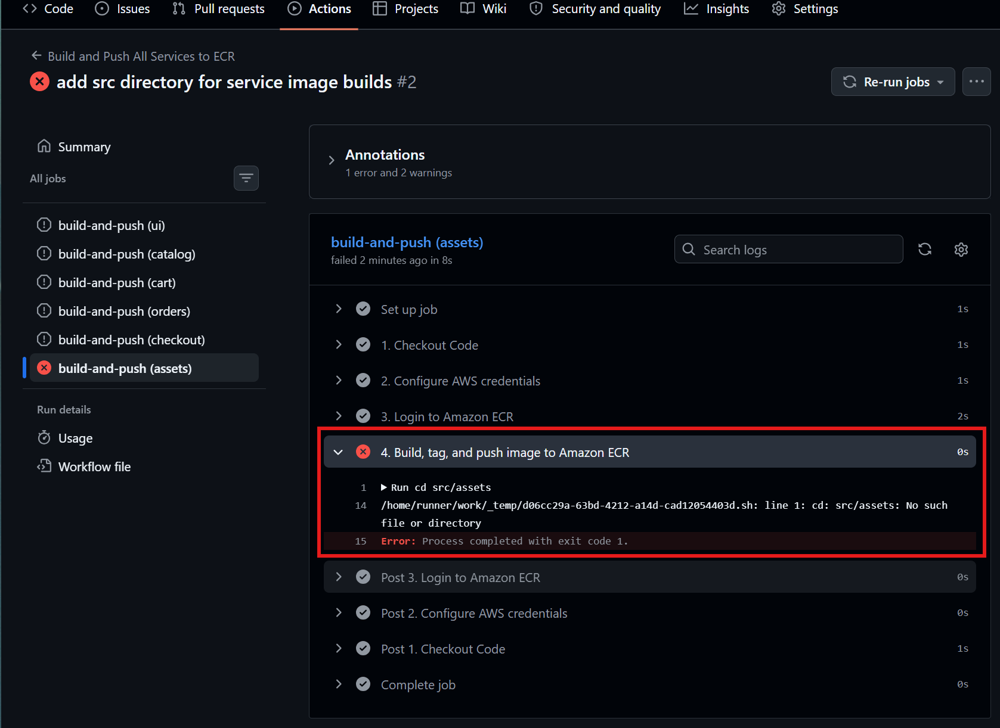
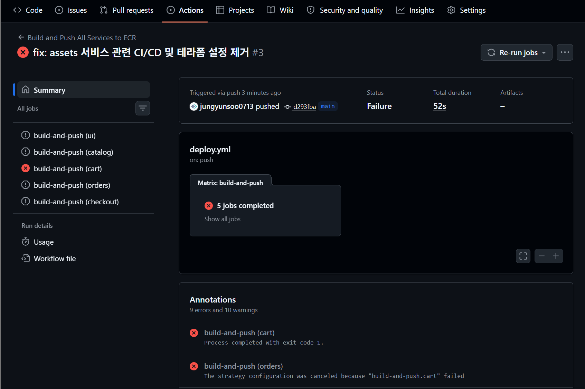
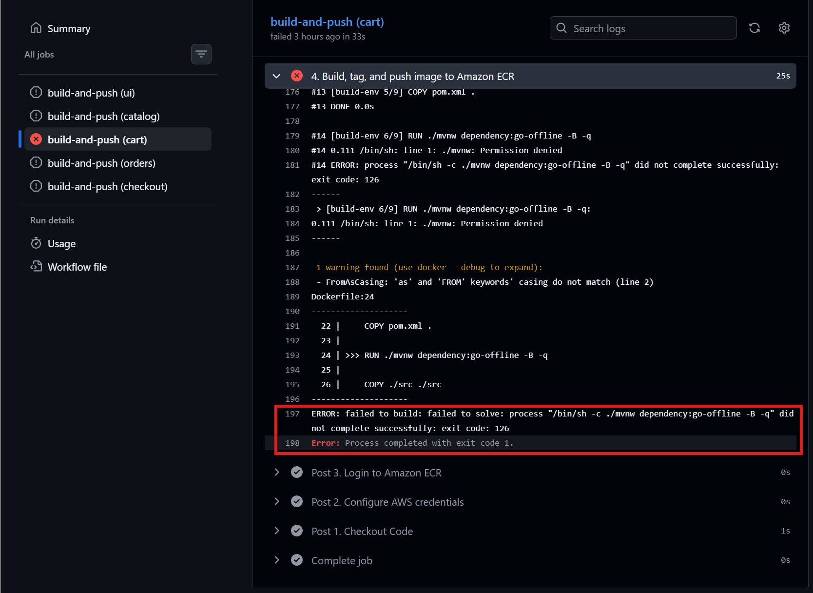
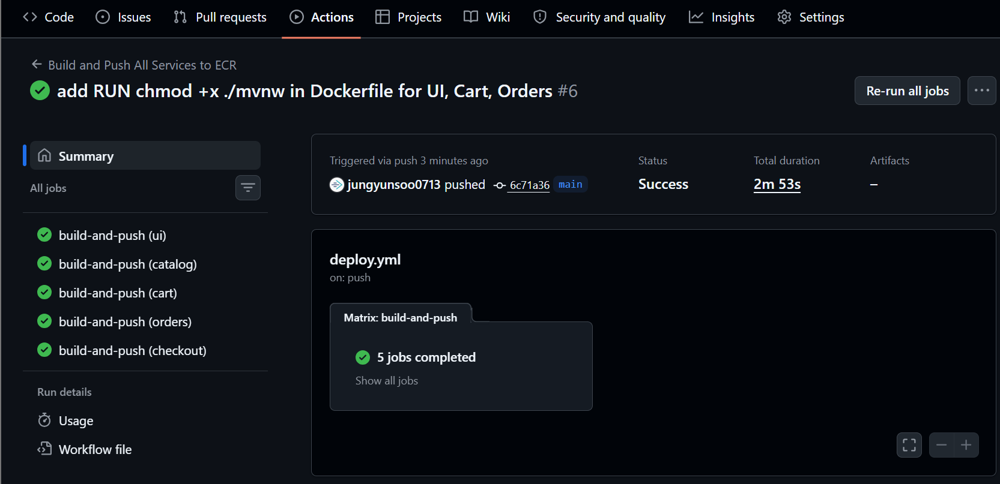

이번 포스트에서는 테라폼을 사용하여 Retail Store Sample App을 빠르게 구축합니다. AWS 인프라를 구축한 뒤, Retail Store Sample App을 ECS 기반으로 배포합니다. 배포 과정에서는 GitHub Actions가 적용됩니다. 이번 포스트에서 작성하는 코드는 프로덕션 환경을 위한 완성된 코드는 아닙니다. 추후 프로덕션 환경에 가까운 구성을 위해, 이 코드를 기반으로 수정과 추가 작업을 진행할 예정입니다.

---

테라폼 코드 등을 작성하기에 앞서서 먼저 `.gitignore` 파일을 작성합니다. `.gitignore` 파일은 GitHub에 코드를 푸시할 때 제외되는 파일 확장자들을 명시합니다. 

```hcl
# Local .terraform directories
**/.terraform/*

# .tfstate files
*.tfstate
*.tfstate.*

# Crash log files
crash.log
crash.*.log

# Exclude all .tfvars files, which are likely to contain sensitive data
*.tfvars
*.tfvars.json

# Ignore override files as they are usually used to override resources locally
override.tf
override.tf.json
*_override.tf
*_override.tf.json

# Ignore transient lock info files created by terraform providers
.terraform.lock.hcl

# Ignore CLI configuration files
.terraformrc
terraform.rc

# Ignore plan output files
*.tfplan

# Ignore backend config files that may contain sensitive info
backend.hcl

# OS generated files
.DS_Store
.DS_Store?
._*
.Spotlight-V100
.Trashes
ehthumbs.db
Thumbs.db

# Editor directories and files
.idea/
.vscode/
*.swp
*.swo
*~
```

`**/.terraform/*`은 `terraform init`을 실행할 때 생성되는 디렉터리입니다. `.terraform`은 로컬에서 테라폼을 실행하기 위한 파일들이 들어 있는 디렉터리입니다. 해당 파일들은 각 로컬 환경에 맞게 생성되기 때문에 GitHub에 올릴 필요가 없습니다.

`*.tfstate`, `*.tfstate.*`는 `terraform apply`를 실행할 때 생기는 파일입니다. 테라폼으로 생성된 인프라의 현재 상태를 기록해두는 파일입니다. 실제 리소스 ID, ARN 같은 민감한 정보가 포함될 수 있기 때문에 GitHub에 올리면 안됩니다.

`crash.log`, `crash.*.log`는 테라폼이 실행중에 비정상적으로 종료되었을 때 생성되는 로그 파일입니다. 로그 파일임으로 프로젝트 코드가 아니고, 환경 정보와 같은 민감한 정보가 포함될 수 있기 때문에 GitHub에 올리면 안됩니다.

`*.tfvars`, `*.tfvars.json`는 Terraform의 변수 값들을 따로 넣어두는 파일로, 이 변수 값들은 다른 코드에서 동적으로 쓰일 수 있습니다. DB 비밀번호 등의 민감한 정보가 포함될 수 있기 때문에 GitHub에 올리면 안 됩니다.

`override.tf`, `override.tf.json`, `*_override.tf`, `*_override.tf.json`는 Terraform 설정을 덮어쓰는 파일들로, 임시 설정이나 로컬에서 테스트하기 위해 쓰입니다. 즉, 사용자 로컬용 파일로 공유되어서는 안 되기 때문에 GitHub에 올리면 안 됩니다.

`.terraform.lock.hcl`은 `terraform init`을 실행할 때 생성되는 파일입니다. 이 파일은 Terraform의 provider 버전을 고정함으로써 Terraform을 실행할 때 다른 provider 버전을 사용하는 것을 막아줍니다. 따라서 이 파일은 일반적으로 GitHub에 올리는것이 좋습니다. 현재는 추가되있기 때문에 추후에 코드를 푸시할 때 제외해줍니다.

`.terraformrc`, `terraform.rc`는 테라폼 CLI 설정 파일로, 로컬에서 테라폼 CLI를 실행할 때 필요한 설정이 담겨 있는 파일입니다. 테라폼 Cloud 접근 시 필요한 토큰 정보 등의 민감한 정보가 포함될 수도 있기 때문에 GitHub에 올리지 않습니다.

`*.tfplan`은 `terraform plan` 결과를 파일로 저장했을 때 생기는 파일임으로 GitHub에 올리지 않습니다.

`backend.hcl`은 테라폼 state를 어디에 저장하는지에 대한 설정으로, state용 S3 버킷 이름, `terraform.tfstate` 저장 경로 등의 값들이 포함될 수 있기 때문에 GitHub에 올리지 않습니다.

---

`.gitignore` 파일의 작성이 끝났다면, `main.tf` 테라폼 파일을 작성하여 AWS 기본 인프라를 구축합니다. VPC, IGW, 퍼블릭 서브넷 2개, 라우트 테이블, 라우트 테이블 어소시에이션 2개, 태스크들을 위지토리 6개, 도합 총 16개의 리소스를 생성합니다. 

```hcl
provider "aws" {
  region = "ap-northeast-2" # 서울 리전
}

locals {
  # 띄워야 할 핵심 마이크로서비스 목록 (필요시 더 추가해!)
  services = ["ui", "catalog", "cart", "orders", "checkout", "assets"]
  vpc_cidr = "10.0.0.0/16"
}

# --------------------------------------------------
# 1. VPC & 네트워크 (빠른 통신을 위해 전부 Public Subnet)
# --------------------------------------------------
resource "aws_vpc" "main" {
  cidr_block           = local.vpc_cidr
  enable_dns_support   = true
  enable_dns_hostnames = true
  tags = { Name = "retail-vpc" }
}

resource "aws_internet_gateway" "igw" {
  vpc_id = aws_vpc.main.id
}

resource "aws_subnet" "public" {
  count                   = 2
  vpc_id                  = aws_vpc.main.id
  cidr_block              = cidrsubnet(local.vpc_cidr, 8, count.index)
  availability_zone       = element(["ap-northeast-2a", "ap-northeast-2c"], count.index)
  map_public_ip_on_launch = true # 컨테이너에 Public IP 자동 할당 (NAT Gateway 비용/시간 절약)
  tags = { Name = "retail-public-subnet-${count.index + 1}" }
}

resource "aws_route_table" "public" {
  vpc_id = aws_vpc.main.id
  route {
    cidr_block = "0.0.0.0/0"
    gateway_id = aws_internet_gateway.igw.id
  }
}

resource "aws_route_table_association" "public" {
  count          = 2
  subnet_id      = aws_subnet.public[count.index].id
  route_table_id = aws_route_table.public.id
}

# --------------------------------------------------
# 2. 공통 보안 그룹 (개판 오분전 룰 적용: 내부 완전 개방)
# --------------------------------------------------
resource "aws_security_group" "ecs_sg" {
  name        = "retail-ecs-sg"
  description = "Allow internal traffic and outbound"
  vpc_id      = aws_vpc.main.id

  # 자기 자신(같은 SG를 가진 서비스)끼리는 모든 포트 통신 허용 (핵심!)
  ingress {
    from_port = 0
    to_port   = 0
    protocol  = "-1"
    self      = true 
  }
  
  # UI 접속을 위한 80포트 오픈
  ingress {
    from_port   = 80
    to_port     = 80
    protocol    = "tcp"
    cidr_blocks = ["0.0.0.0/0"]
  }

  egress {
    from_port   = 0
    to_port     = 0
    protocol    = "-1"
    cidr_blocks = ["0.0.0.0/0"]
  }
}

# --------------------------------------------------
# 3. ECS 클러스터 & Cloud Map (마이크로서비스용 내비게이션)
# --------------------------------------------------
resource "aws_ecs_cluster" "main" {
  name = "retail-cluster"
}

# 각 서비스가 "http://catalog.retail.local" 처럼 통신할 수 있게 해줌
resource "aws_service_discovery_private_dns_namespace" "internal" {
  name        = "retail.local"
  description = "Service discovery for retail sample app"
  vpc         = aws_vpc.main.id
}

# --------------------------------------------------
# 4. ECR 저장소 (for_each로 한 방에 찍어내기)
# --------------------------------------------------
resource "aws_ecr_repository" "services" {
  for_each             = toset(local.services)
  name                 = "retail-${each.key}"
  image_tag_mutability = "MUTABLE"
  force_delete         = true # 이미지가 있어도 강제 삭제되도록 올바른 속성으로 수정!
}
```

`main.tf` 파일을 작성한 후 `terraform init`으로 테라폼을 실행하는 환경을 초기화해줍니다. 

```
young@young:~/y-so-cereal$ terraform init
...
```

`terraform init` 명령어가 성공했으면 `terraform validate`로 테라폼 코드와 리소스 구성이 유효한지 검사할 수 있습니다. 마지막으로 `terraform apply`로 실제 테라폼 코드로 작성된 리소스를 생성합니다. `terraform apply`는 `terraform plan`처럼 어떤 리소스들이 생성/수정/삭제되는지 보여줍니다. 그 후 프롬프트에 `yes`를 입력하면 실제 리소스를 생성/수정/삭제하는 절차에 들어갑니다. 

다음은 `terraform apply` 명령어의 출력입니다.

```bash
young@young:~/y-so-cereal$ terraform apply

Terraform used the selected providers to generate the following execution plan. Resource actions are indicated with the following symbols:
  + create

Terraform will perform the following actions:

  # aws_ecr_repository.services["assets"] will be created
  + resource "aws_ecr_repository" "services" {
      + arn                  = (known after apply)
      + force_delete         = true
      + id                   = (known after apply)
      + image_tag_mutability = "MUTABLE"
      + name                 = "retail-assets"
      + region               = "ap-northeast-2"
      + registry_id          = (known after apply)
      + repository_url       = (known after apply)
      + tags_all             = (known after apply)
    }

  # aws_ecr_repository.services["cart"] will be created
  + resource "aws_ecr_repository" "services" {
      + arn                  = (known after apply)
      + force_delete         = true
      + id                   = (known after apply)
      + image_tag_mutability = "MUTABLE"
      + name                 = "retail-cart"
      + region               = "ap-northeast-2"
      + registry_id          = (known after apply)
      + repository_url       = (known after apply)
      + tags_all             = (known after apply)
    }

  # aws_ecr_repository.services["catalog"] will be created
  + resource "aws_ecr_repository" "services" {
      + arn                  = (known after apply)
      + force_delete         = true
      + id                   = (known after apply)
      + image_tag_mutability = "MUTABLE"
      + name                 = "retail-catalog"
      + region               = "ap-northeast-2"
      + registry_id          = (known after apply)
      + repository_url       = (known after apply)
      + tags_all             = (known after apply)
    }

  # aws_ecr_repository.services["checkout"] will be created
  + resource "aws_ecr_repository" "services" {
      + arn                  = (known after apply)
      + force_delete         = true
      + id                   = (known after apply)
      + image_tag_mutability = "MUTABLE"
      + name                 = "retail-checkout"
      + region               = "ap-northeast-2"
      + registry_id          = (known after apply)
      + repository_url       = (known after apply)
      + tags_all             = (known after apply)
    }

  # aws_ecr_repository.services["orders"] will be created
  + resource "aws_ecr_repository" "services" {
      + arn                  = (known after apply)
      + force_delete         = true
      + id                   = (known after apply)
      + image_tag_mutability = "MUTABLE"
      + name                 = "retail-orders"
      + region               = "ap-northeast-2"
      + registry_id          = (known after apply)
      + repository_url       = (known after apply)
      + tags_all             = (known after apply)
    }

  # aws_ecr_repository.services["ui"] will be created
  + resource "aws_ecr_repository" "services" {
      + arn                  = (known after apply)
      + force_delete         = true
      + id                   = (known after apply)
      + image_tag_mutability = "MUTABLE"
      + name                 = "retail-ui"
      + region               = "ap-northeast-2"
      + registry_id          = (known after apply)
      + repository_url       = (known after apply)
      + tags_all             = (known after apply)
    }

  # aws_ecs_cluster.main will be created
  + resource "aws_ecs_cluster" "main" {
      + arn      = (known after apply)
      + id       = (known after apply)
      + name     = "retail-cluster"
      + region   = "ap-northeast-2"
      + tags_all = (known after apply)

      + setting (known after apply)
    }

  # aws_internet_gateway.igw will be created
  + resource "aws_internet_gateway" "igw" {
      + arn      = (known after apply)
      + id       = (known after apply)
      + owner_id = (known after apply)
      + region   = "ap-northeast-2"
      + tags_all = (known after apply)
      + vpc_id   = (known after apply)
    }

  # aws_route_table.public will be created
  + resource "aws_route_table" "public" {
      + arn              = (known after apply)
      + id               = (known after apply)
      + owner_id         = (known after apply)
      + propagating_vgws = (known after apply)
      + region           = "ap-northeast-2"
      + route            = [
          + {
              + cidr_block                 = "0.0.0.0/0"
              + gateway_id                 = (known after apply)
                # (12 unchanged attributes hidden)
            },
        ]
      + tags_all         = (known after apply)
      + vpc_id           = (known after apply)
    }

  # aws_route_table_association.public[0] will be created
  + resource "aws_route_table_association" "public" {
      + id             = (known after apply)
      + region         = "ap-northeast-2"
      + route_table_id = (known after apply)
      + subnet_id      = (known after apply)
    }

  # aws_route_table_association.public[1] will be created
  + resource "aws_route_table_association" "public" {
      + id             = (known after apply)
      + region         = "ap-northeast-2"
      + route_table_id = (known after apply)
      + subnet_id      = (known after apply)
    }

  # aws_security_group.ecs_sg will be created
  + resource "aws_security_group" "ecs_sg" {
      + arn                    = (known after apply)
      + description            = "Allow internal traffic and outbound"
      + egress                 = [
          + {
              + cidr_blocks      = [
                  + "0.0.0.0/0",
                ]
              + from_port        = 0
              + ipv6_cidr_blocks = []
              + prefix_list_ids  = []
              + protocol         = "-1"
              + security_groups  = []
              + self             = false
              + to_port          = 0
                # (1 unchanged attribute hidden)
            },
        ]
      + id                     = (known after apply)
      + ingress                = [
          + {
              + cidr_blocks      = [
                  + "0.0.0.0/0",
                ]
              + from_port        = 80
              + ipv6_cidr_blocks = []
              + prefix_list_ids  = []
              + protocol         = "tcp"
              + security_groups  = []
              + self             = false
              + to_port          = 80
                # (1 unchanged attribute hidden)
            },
          + {
              + cidr_blocks      = []
              + from_port        = 0
              + ipv6_cidr_blocks = []
              + prefix_list_ids  = []
              + protocol         = "-1"
              + security_groups  = []
              + self             = true
              + to_port          = 0
                # (1 unchanged attribute hidden)
            },
        ]
      + name                   = "retail-ecs-sg"
      + name_prefix            = (known after apply)
      + owner_id               = (known after apply)
      + region                 = "ap-northeast-2"
      + revoke_rules_on_delete = false
      + tags_all               = (known after apply)
      + vpc_id                 = (known after apply)
    }

  # aws_service_discovery_private_dns_namespace.internal will be created
  + resource "aws_service_discovery_private_dns_namespace" "internal" {
      + arn         = (known after apply)
      + description = "Service discovery for retail sample app"
      + hosted_zone = (known after apply)
      + id          = (known after apply)
      + name        = "retail.local"
      + region      = "ap-northeast-2"
      + tags_all    = (known after apply)
      + vpc         = (known after apply)
    }

  # aws_subnet.public[0] will be created
  + resource "aws_subnet" "public" {
      + arn                                            = (known after apply)
      + assign_ipv6_address_on_creation                = false
      + availability_zone                              = "ap-northeast-2a"
      + availability_zone_id                           = (known after apply)
      + cidr_block                                     = "10.0.0.0/24"
      + enable_dns64                                   = false
      + enable_resource_name_dns_a_record_on_launch    = false
      + enable_resource_name_dns_aaaa_record_on_launch = false
      + id                                             = (known after apply)
      + ipv6_cidr_block                                = (known after apply)
      + ipv6_cidr_block_association_id                 = (known after apply)
      + ipv6_native                                    = false
      + map_public_ip_on_launch                        = true
      + owner_id                                       = (known after apply)
      + private_dns_hostname_type_on_launch            = (known after apply)
      + region                                         = "ap-northeast-2"
      + tags                                           = {
          + "Name" = "retail-public-subnet-xxxxxxxxxxxxxxxxx"
        }
      + tags_all                                       = {
          + "Name" = "retail-public-subnet-xxxxxxxxxxxxxxxxx"
        }
      + vpc_id                                         = (known after apply)
    }

  # aws_subnet.public[1] will be created
  + resource "aws_subnet" "public" {
      + arn                                            = (known after apply)
      + assign_ipv6_address_on_creation                = false
      + availability_zone                              = "ap-northeast-2c"
      + availability_zone_id                           = (known after apply)
      + cidr_block                                     = "10.0.1.0/24"
      + enable_dns64                                   = false
      + enable_resource_name_dns_a_record_on_launch    = false
      + enable_resource_name_dns_aaaa_record_on_launch = false
      + id                                             = (known after apply)
      + ipv6_cidr_block                                = (known after apply)
      + ipv6_cidr_block_association_id                 = (known after apply)
      + ipv6_native                                    = false
      + map_public_ip_on_launch                        = true
      + owner_id                                       = (known after apply)
      + private_dns_hostname_type_on_launch            = (known after apply)
      + region                                         = "ap-northeast-2"
      + tags                                           = {
          + "Name" = "retail-public-subnet-xxxxxxxxxxxxxxxxx"
        }
      + tags_all                                       = {
          + "Name" = "retail-public-subnet-xxxxxxxxxxxxxxxxx"
        }
      + vpc_id                                         = (known after apply)
    }

  # aws_vpc.main will be created
  + resource "aws_vpc" "main" {
      + arn                                  = (known after apply)
      + cidr_block                           = "10.0.0.0/16"
      + default_network_acl_id               = (known after apply)
      + default_route_table_id               = (known after apply)
      + default_security_group_id            = (known after apply)
      + dhcp_options_id                      = (known after apply)
      + enable_dns_hostnames                 = true
      + enable_dns_support                   = true
      + enable_network_address_usage_metrics = (known after apply)
      + id                                   = (known after apply)
      + instance_tenancy                     = "default"
      + ipv6_association_id                  = (known after apply)
      + ipv6_cidr_block                      = (known after apply)
      + ipv6_cidr_block_network_border_group = (known after apply)
      + main_route_table_id                  = (known after apply)
      + owner_id                             = (known after apply)
      + region                               = "ap-northeast-2"
      + tags                                 = {
          + "Name" = "retail-vpc"
        }
      + tags_all                             = {
          + "Name" = "retail-vpc"
        }
    }

Plan: 16 to add, 0 to change, 0 to destroy.

Do you want to perform these actions?
  Terraform will perform the actions described above.
  Only 'yes' will be accepted to approve.

  Enter a value: yes

aws_ecr_repository.services["assets"]: Creating...
aws_ecr_repository.services["catalog"]: Creating...
aws_ecs_cluster.main: Creating...
aws_ecr_repository.services["ui"]: Creating...
aws_ecr_repository.services["orders"]: Creating...
aws_vpc.main: Creating...
aws_ecr_repository.services["cart"]: Creating...
aws_ecr_repository.services["checkout"]: Creating...
aws_ecr_repository.services["checkout"]: Creation complete after 0s [id=retail-checkout]
aws_ecr_repository.services["assets"]: Creation complete after 0s [id=retail-assets]
aws_ecr_repository.services["cart"]: Creation complete after 1s [id=retail-cart]
aws_ecr_repository.services["orders"]: Creation complete after 1s [id=retail-orders]
aws_ecr_repository.services["ui"]: Creation complete after 1s [id=retail-ui]
aws_ecr_repository.services["catalog"]: Creation complete after 1s [id=retail-catalog]
aws_vpc.main: Creation complete after 2s [id=vpc-xxxxxxxxxxxxxxxxx]
aws_internet_gateway.igw: Creating...
aws_service_discovery_private_dns_namespace.internal: Creating...
aws_subnet.public[0]: Creating...
aws_subnet.public[1]: Creating...
aws_security_group.ecs_sg: Creating...
aws_internet_gateway.igw: Creation complete after 1s [id=igw-xxxxxxxxxxxxxxxxx]
aws_route_table.public: Creating...
aws_route_table.public: Creation complete after 1s [id=rtb-xxxxxxxxxxxxxxxxx]
aws_security_group.ecs_sg: Creation complete after 3s [id=sg-xxxxxxxxxxxxxxxxx]
aws_ecs_cluster.main: Still creating... [00m10s elapsed]
aws_ecs_cluster.main: Creation complete after 11s [id=arn:aws:ecs:ap-northeast-2:<ACCOUNT_ID>:cluster/retail-cluster]
aws_service_discovery_private_dns_namespace.internal: Still creating... [00m10s elapsed]
aws_subnet.public[0]: Still creating... [00m10s elapsed]
aws_subnet.public[1]: Still creating... [00m10s elapsed]
aws_subnet.public[1]: Creation complete after 11s [id=subnet-xxxxxxxxxxxxxxxxx]
aws_subnet.public[0]: Creation complete after 11s [id=subnet-xxxxxxxxxxxxxxxxx]
aws_route_table_association.public[1]: Creating...
aws_route_table_association.public[0]: Creating...
aws_route_table_association.public[0]: Creation complete after 1s [id=rtbassoc-xxxxxxxxxxxxxxxxx]
aws_route_table_association.public[1]: Creation complete after 1s [id=rtbassoc-xxxxxxxxxxxxxxxxx]
aws_service_discovery_private_dns_namespace.internal: Still creating... [00m20s elapsed]
aws_service_discovery_private_dns_namespace.internal: Still creating... [00m30s elapsed]
aws_service_discovery_private_dns_namespace.internal: Still creating... [00m40s elapsed]
aws_service_discovery_private_dns_namespace.internal: Creation complete after 44s [id=ns-xxxxxxxxxxxxxxxx]

Apply complete! Resources: 16 added, 0 changed, 0 destroyed.
```

테라폼으로 작성된 리소스들이 전부 정상적으로 생성되었음을 알 수 있습니다.

이제 로컬에서 작성한 코드를 GitHub 원격 저장소에 푸시하겠습니다. 정상적으로 푸시가 완료되었습니다.

---

다음은 CI/CD 파이프라인의 첫 단계로, 컨테이너 이미지를 빌드하고 ECR에 푸시하는 `deploy.yml` GitHub Actions 파일을 작성합니다.

```yml
name: Build and Push All Services to ECR

on:
  push:
    branches:
      - main # main 브랜치에 코드가 푸시되면 자동 실행
  workflow_dispatch: # GitHub 웹에서 수동으로 버튼 눌러서 실행할 수 있는 옵션 (테스트할 때 꿀기능!)

env:
  AWS_REGION: ap-northeast-2 # 본인이 Terraform에서 설정한 리전과 동일하게 맞출 것

jobs:
  build-and-push:
    runs-on: ubuntu-latest
    
    # 💡 핵심: matrix를 쓰면 아래 배열에 있는 서비스 개수만큼 작업을 동시에 병렬로 실행함!
    strategy:
      matrix:
        service: [ui, catalog, cart, orders, checkout]

    steps:
      - name: 1. Checkout Code
        uses: actions/checkout@v3

      - name: 2. Configure AWS credentials
        uses: aws-actions/configure-aws-credentials@v2
        with:
          aws-access-key-id: ${{ secrets.AWS_ACCESS_KEY_ID }}
          aws-secret-access-key: ${{ secrets.AWS_SECRET_ACCESS_KEY }}
          aws-region: ${{ env.AWS_REGION }}

      - name: 3. Login to Amazon ECR
        id: login-ecr
        uses: aws-actions/amazon-ecr-login@v1

      - name: 4. Build, tag, and push image to Amazon ECR
        env:
          ECR_REGISTRY: ${{ steps.login-ecr.outputs.registry }}
          ECR_REPOSITORY: retail-${{ matrix.service }}
          IMAGE_TAG: latest # 원래는 ${{ github.sha }} 같은 해시값을 쓰지만, 개판 오분전 전략이므로 latest로 덮어쓰기!
        # 앱 소스코드가 src/ui, src/catalog 폴더 안에 있다고 가정
        run: |
          cd src/${{ matrix.service }}
          docker build -t $ECR_REGISTRY/$ECR_REPOSITORY:$IMAGE_TAG .
          docker push $ECR_REGISTRY/$ECR_REPOSITORY:$IMAGE_TAG
```

이 워크플로우는 GitHub Actions를 사용해 Retail Store Sample App의 각 서비스 이미지를 병렬로 빌드하고 Amazon ECR에 푸시하는 CI/CD 파이프라인의 초기 단계입니다. 아직 ECS 서비스 업데이트까지 수행하지는 않으며, 배포에 사용할 컨테이너 이미지를 준비하는 역할을 합니다.

이 `deploy.yml` 파일은  `.github/workflows`에 위치시킵니다. 이제 GitHub에 코드를 푸시합니다.

```bash
young@young:~/y-so-cereal$ git add .
young@young:~/y-so-cereal$ git commit -m "add deploy.yml"
[main 77e7cf6] add deploy.yml
 3 files changed, 69 insertions(+), 3 deletions(-)
 create mode 100644 .github/workflows/deploy.yml
 create mode 100644 .terraform.lock.hcl
young@young:~/y-so-cereal$ git push origin main
Enumerating objects: 9, done.
Counting objects: 100% (9/9), done.
Delta compression using up to 8 threads
Compressing objects: 100% (5/5), done.
Writing objects: 100% (7/7), 2.25 KiB | 2.25 MiB/s, done.
Total 7 (delta 1), reused 0 (delta 0), pack-reused 0
remote: Resolving deltas: 100% (1/1), completed with 1 local object.
To https://github.com/jungyunsoo0713/y-so-cereal.git
   e0a64d7..77e7cf6  main -> main
```

코드 푸시는 정상적으로 완료되었습니다. 하지만 GitHub Actions의 워크플로우 실행이 실패하였습니다. `main` 브랜치에 코드를 푸시하였기 때문에 GitHub Actions 워크플로우가 자동으로 실행되었지만, 모종의 이유로 실행에 실패하였습니다.



Annotations에서 에러를 확인해보면 `Credentials could not be loaded, please check your action inputs: Could not load credentials from any providers`라고 나와 있습니다. 이는 GitHub 리포지토리에 AWS 인증 정보를 입력하지 않았거나, 잘못된 값이 입력되었을 때 발생하는 에러입니다. 

현재 AWS 인증 정보가 등록되어 있지 않기 때문에 GitHub repo → Settings → Secrets and variables → Actions → Repository secrets에서 `AWS_ACCESS_KEY_ID`와 `AWS_SECRET_ACCESS_KEY`를 등록해야 합니다.

>참고로 Terraform에서 AWS에 접근이 되는 것은 로컬 환경에 있는 AWS 인증 정보(`aws configure list`로 확인 가능)를 사용하기 때문입니다. GitHub Actions는 GitHub repo에 등록되어 있는 AWS 인증 정보를 사용합니다.

Actions secrets and variables에 AWS 인증 정보를 등록합니다. 



AWS 인증 정보 등록 후, 다시 워크플로우를 재시작(`Re-run all jobs`)합니다.



또 다시 워크플로우 실행에 실패했습니다. 에러 메시지를 보면, `The strategy configuration was cancelled because "build-and-push.cart" failed`라고 나와있습니다.



이 에러는 `assets` 자체의 에러가 아니라 `build-and-push.cart` 작업이 먼저 실패해서, `deploy.yml`의 matrix 전략에 의해 실행 중이던 다른 작업들 중 `assets` 작업이 취소되었다는 의미입니다. matrix 전략은 여러 이미지 빌드 작업을 병렬로 실행하는데, 기본값으로 `fail-fast`가 활성화되어 있기 때문에 하나의 이미지 빌드 작업이 실패하면 아직 완료되지 않은 다른 이미지 빌드 작업이 취소될 수 있습니다.

따라서 실제 원인을 찾으려면 `cart`에 대한 에러 로그를 찾아야 합니다.



에러 로그를 자세히 들여다보면

```
Run cd src/cart

...

/home/runner/work/_temp/0df0ffea-6fd1-47f8-9aaa-41a58c43c77e.sh: line 1: cd: src/cart: No such file or directory

Error: Process completed with exit code 1.
```

`src/cart: No such file or directory`를 확인할 수 있습니다. 이는 `src/cart` 디렉터리가 존재하지 않기 때문에 발생하는 에러입니다. 원래 이 디렉터리에는 이미지를 빌드하기 위해 필요한 `Dockerfile`과 애플리케이션 소스 코드가 있어야 합니다.

다음과 같은 파일들이 있어야 이미지를 빌드할 수 있습니다.

```
src/cart 디렉터리
├── Dockerfile          ← Docker 이미지 빌드 방법이 적힌 파일
├── package.json 등     ← 애플리케이션 의존성 정보
└── 애플리케이션 소스 코드 ← Dockerfile 안의 명령어가 애플리케이션 소스 코드를 이미지 안으로 복사하거나, 빌드 과정에서 사용합니다
```

[Retail Store Sample App](https://github.com/aws-containers/retail-store-sample-app) GitHub 리포지토리에서 코드를 다운로드한 뒤, `src` 디렉터리를 가져와 프로젝트의 루트 디렉터리에 넣고 애플리케이션 소스 코드로 사용합니다.

이제 다시 코드를 푸시합니다.



다시 워크플로우 실행이 실패했습니다.



에러 메시지에서 `cd: src/assets: No such file or directory`라는 내용을 확인할 수 있습니다. `assets` 서비스는 원래 존재하지 않는 서비스입니다. Retail Store Sample App에 존재하는 서비스는 UI, Catalog, Cart, Orders, Checkout이며, Assets 서비스는 포함되어 있지 않습니다. 따라서 `src/assets` 경로가 없기 때문에 에러가 발생하여 워크플로우가 실패했습니다.

`main.tf`와 `deploy.yml`에 있는 `assets`에 대한 설정을 삭제해줍니다. 

`main.tf`

```hcl

...

locals {
  # 띄워야 할 핵심 마이크로서비스 목록 (필요시 더 추가해!)
  services = ["ui", "catalog", "cart", "orders", "checkout"] # "assets" 삭제
  vpc_cidr = "10.0.0.0/16"
}

...

```

`deploy.tf`

```

...

    strategy:
      matrix:
        service: [ui, catalog, cart, orders, checkout] # assets 삭제

...

```

인프라가 수정되었기 때문에 `terraform plan`과 `terraform apply`로 불필요해진 `assets`관련 리소스(ECR 리포짓토리)를 삭제합니다.

```bash
young@young:~/y-so-cereal$ terraform apply

...

Terraform will perform the following actions:

  # aws_ecr_repository.services["assets"] will be destroyed
  # (because key ["assets"] is not in for_each map)
  - resource "aws_ecr_repository" "services" {
      - arn                  = "arn:aws:ecr:ap-northeast-2:802104112480:repository/retail-assets" -> null
      - force_delete         = true -> null
      - id                   = "retail-assets" -> null
      - image_tag_mutability = "MUTABLE" -> null
      - name                 = "retail-assets" -> null
      - region               = "ap-northeast-2" -> null
      - registry_id          = "802104112480" -> null
      - repository_url       = "802104112480.dkr.ecr.ap-northeast-2.amazonaws.com/retail-assets" -> null
      - tags                 = {} -> null
      - tags_all             = {} -> null

      - encryption_configuration {
          - encryption_type = "AES256" -> null
            # (1 unchanged attribute hidden)
        }

      - image_scanning_configuration {
          - scan_on_push = false -> null
        }
    }

Plan: 0 to add, 0 to change, 1 to destroy.

Do you want to perform these actions?
  Terraform will perform the actions described above.
  Only 'yes' will be accepted to approve.

  Enter a value: yes

aws_ecr_repository.services["assets"]: Destroying... [id=retail-assets]
aws_ecr_repository.services["assets"]: Destruction complete after 0s
```

또한 `src` 디렉터리가 추가되었기 때문에 GitHub에 코드를 푸시합니다.

다시 워크플로우 실행이 실패했습니다.



cart의 에러 메시지를 확인하면



`exit code: 126`을 볼 수 있습니다. 이는 해당 파일을 실행할 권한이 없다는 것을 의미합니다. 도커가 이미지를 빌드할 때 `/bin/sh -c ./mvnw ...` 명령어를 통해 메이븐 래퍼(`mvnw`) 스크립트를 실행하려고 시도했는데, 이 파일(`src/cart/mvnw`)에 실행 권한(Executable permission)이 없기 때문에 이미지를 빌드할 수 없습니다. 메이븐은 자바 빌드 도구이고, 메이븐 래퍼는 메이븐 설치 없이 바로 빌드할 수 있게 해주는 실행 스크립트입니다.

따라서 이 에러를 해결하려면 메이븐 래퍼에 실행 권한을 부여해야 합니다. 메이븐 래퍼는 자바 빌드 도구이기 때문에 자바로 작성된 서비스인 UI, Cart, Order 서비스에만 실행 권한을 부여하면 됩니다. 

| Component | Language | Description                             |
| --------- | -------- | --------------------------------------- |
| UI        | Java     | Store user interface                    |
| Catalog   | Go       | Product catalog API                     |
| Cart      | Java     | User shopping carts API                 |
| Orders    | Java     | User orders API                         |
| Checkout  | Node.js  | API to orchestrate the checkout process |

다음 명령어로 메이븐 래퍼에 실행 권한을 부여합니다.

```bash
young@young:~/y-so-cereal$ git update-index --chmod=+x src/ui/mvnw
git update-index --chmod=+x src/cart/mvnw
git update-index --chmod=+x src/orders/mvnw
```

위 명령어를 실행한 뒤 파일의 권한을 확인해 보면 여전히 `-rw-r--r--`로 출력되며, 실행 권한(`x`)이 포함되어 있지 않습니다. 이는 `git update-index --chmod=+x` 명령어가 내 컴퓨터의 실제 파일이 아니라, GitHub 저장소에 올라갈 파일의 상태(Git 인덱스)에만 실행 권한을 부여하기 때문입니다. 

```bash
young@young:~/y-so-cereal/src/cart$ ls -l mvnw
-rw-r--r-- 1 young young 10665 May 29 11:46 mvnw
```

이는 Git이 로컬 운영체제의 권한을 임의로 변경하지 않도록 설계되었기 때문입니다. Git은 소스 코드를 관리할 뿐, 운영체제의 권한을 직접 조작하는 것을 지양하기 때문입니다.

이제 코드를 푸시하면 GitHub Actions 워크플로우가 다시 시작됩니다.

다시 워크플로우 실행이 실패했습니다. 

에러 메시지를 보니 같은 이유로 워크플로우 실행에 실패했습니다. `src/cart/Dockerfile` 파일을 열어서 `RUN chmod +x ./mvnw` 명령어 한 줄을 `RUN ./mvnw dependency:go-offline -B -q` 바로 위에 추가합니다. 이 명령어는 도커 컨테이너 안에서 메이븐 래퍼를 실행하기 직전에 무조건 실행 권한을 부여합니다. 마찬가지로 UI와 Orders 디렉터리에도 이 명령어를 추가합니다.

워크플로우 실행에 성공했습니다.


