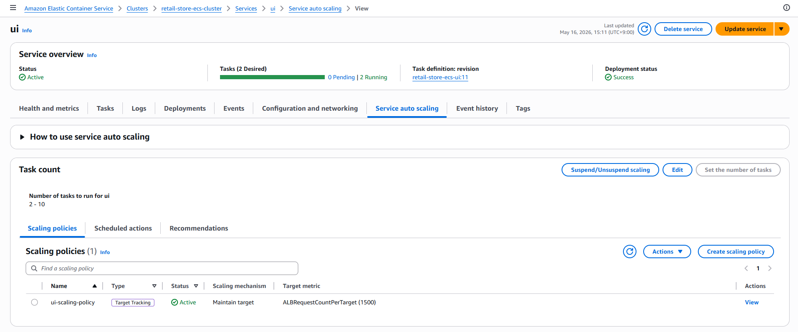
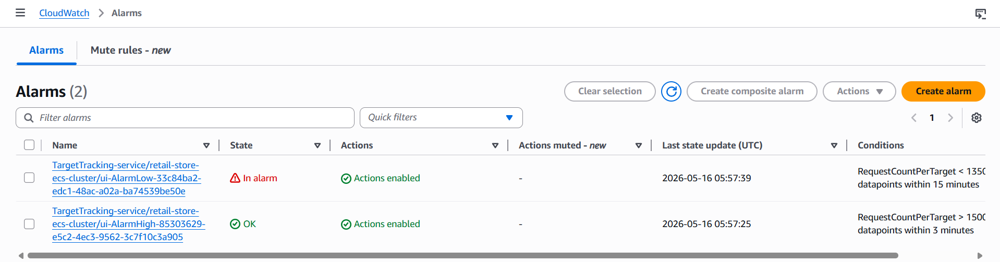

> **작성일:** 2026-05-16 | **수정일:** 2026-05-16

이번 섹션에서는 ECS Service Auto Scaling에 Target Tracking Scaling Policy를 설정하는 법을 알아봅니다. 이 설정을 위해서는 첫 번째로 스케일링 대상을 등록해야 하고, 두 번째로는 스케일링 정책을 생성해야 합니다.

---

다음 명령어를 실행하여 ECS 서비스를 Application Auto Scaling의 스케일링 대상으로 등록합니다.

```bash
aws application-autoscaling register-scalable-target \
    --service-namespace ecs \
    --scalable-dimension ecs:service:DesiredCount \
    --resource-id service/retail-store-ecs-cluster/ui \
    --min-capacity 2 \
    --max-capacity 10
```

`--service-namespace` 옵션은 Application Auto Scaling이 적용될 AWS 서비스를 지정합니다. ECS에서 이 기능을 사용하므로 옵션값은 `ecs`입니다.

`--scalable-dimension` 옵션은 스케일링할 대상을 지정합니다. `ecs:service:DesiredCount`는 스케일링할 대상으로 ECS 서비스의 `DesiredCount`를 지정합니다. `DesiredCount`는 원하는 태스크 수를 의미합니다.

`--resource-id` 옵션은 Application Auto Scaling이 적용될 ECS 서비스의 ID를 지정합니다. 여기서는 UI 서비스의 ID가 포함된 `service/retail-store-ecs-cluster/ui`를 지정합니다.

`--min-capacity 2`와 `--max-capacity 10`은 스케일링으로 태스크 수를 조절할 때 최소 태스크 수는 2개로, 최대 태스크 수는 10개로 설정합니다.

---

다음 명령어를 실행하여 Application Auto Scaling 정책을 설정합니다.

```bash
cat << EOF > ui-scaling-policy.json
{
    "TargetValue": 1500,
    "PredefinedMetricSpecification": {
        "PredefinedMetricType": "ALBRequestCountPerTarget",
        "ResourceLabel": "$UI_ALB_PREFIX/$UI_TG_PREFIX"
    }
}
EOF
```

`"TargetValue": 1500`은 타깃(태스크) 하나당 목표 요청 수를 분당 1500개로 유지함을 의미합니다.

`"PredefinedMetricSpecification"`은 오토 스케일링의 기준이 되는 메트릭을 정의합니다.

`"PredefinedMetricType"`는 어떤 메트릭을 사용할 지 정합니다. 여기서는 `"ALBRequestCountPerTarget"`를 사용합니다. 이 메트릭은 ALB에 등록된 타깃 하나당 요청 수를 의미합니다. 

`"ResourceLabel"`은 어떤 리소스를 모니터링할지 지정합니다. 여기서는 `$UI_ALB_PREFIX`와 `$UI_TG_PREFIX` 변수를 참조합니다. `$UI_ALB_PREFIX`의 값은 `app/retail-store-ecs-ui/233c8e786578d4ed`이고 `$UI_TG_PREFIX`의 값은`targetgroup/BlueTargetGroup/23b388d42dd7bd61`입니다. `ResourceLabel`은 리소스의 전체 ARN을 참조하는 것이 아니라 리소스의 ID 부분만 참조합니다. 예를 들어 `arn:aws:elasticloadbalancing:region:account-id:loadbalancer/app/로드밸런서이름/로드밸런서ID`에서 `app/로드밸런서이름/로드밸런서ID` 부분만 참조하기 때문에 변수 이름에 `PREFIX`가 붙은 것입니다.

이 Application Auto Scaling 정책을 요약하자면, ALB에 등록된 태스크 하나당 분당 1500개의 요청이 들어오도록 태스크 수를 조절한다는 것을 의미합니다.

---

다음 명령어를 실행해서 ECS 서비스에 Target Tracking Scaling Policy를 적용합니다.

```bash
aws application-autoscaling put-scaling-policy \
    --service-namespace ecs \
    --scalable-dimension ecs:service:DesiredCount \
    --resource-id service/retail-store-ecs-cluster/ui \
    --policy-name ui-scaling-policy --policy-type TargetTrackingScaling \
    --target-tracking-scaling-policy-configuration file://ui-scaling-policy.json
```

`--policy-type` 옵션으로 해당 오토 스케일링 정책의 스케일링 전략을 명시합니다.

---

AWS 콘솔의 클러스터 탭에서 Target Tracking Scaling Policy를 리뷰할 수 있습니다.



---

AWS 콘솔의 CloudWatch 탭에서 Target Tracking Scaling Policy가 발생시킨 CloudWatch Alarm을 확인할 수 있습니다.



첫 번째 Alarm은 스케일링 인을 발생시킵니다. Conditions의 내용을 보면 15분 동안 찍힌 15개의 datapoint가 ALB에 등록된 태스크 하나당 분당 1350개 미만의 요청 수를 나타낸다면 스케일링 인을 발생시킵니다.

두 번째 Alarm은 스케일링 아웃을 발생시킵니다. Conditions의 내용을 보면 3분 동안 찍힌 3개의 datapoint가 ALB에 등록된 태스크 하나당 분당 1500개 초과의 요청 수를 나타낸다면 스케일링 아웃을 발생시킵니다.

일반적으로 스케일링 인의 설정이 스케일링 아웃의 설정보다 더 보수적으로 되어있습니다. 이는 태스크를 줄였다가 다시 늘려야 하는 상황이 생기면 트래픽을 바로 처리할 수 없기 때문입니다.
