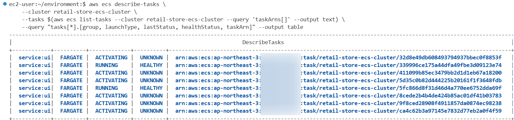
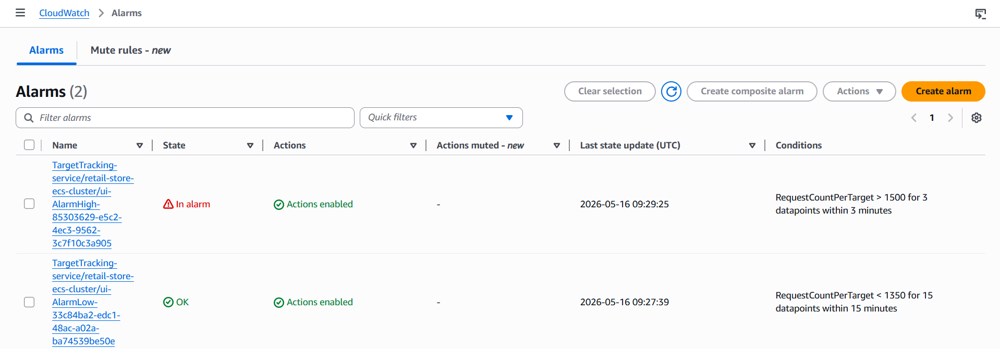
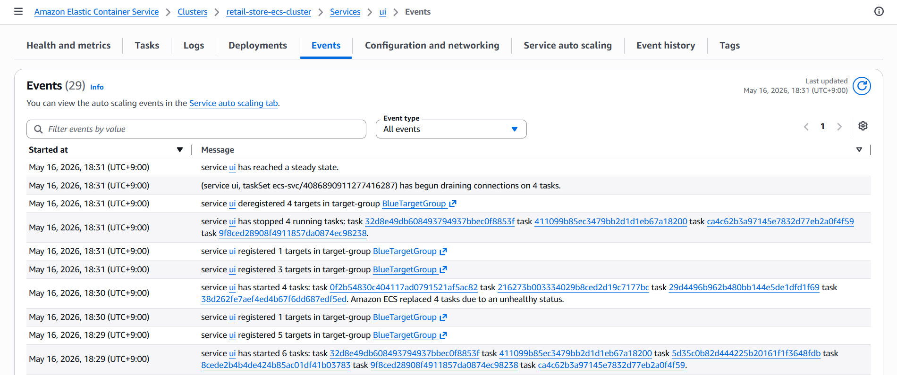

> **작성일:** 2026-05-16 | **수정일:** 2026-05-16

이번 섹션에서는 이전에 설정한 Target Tracking Scaling을 발생시켜보겠습니다.

---

다음 명령어를 실행하여 UI 서비스의 ALB의 DNS 이름을 변수에 저장합니다.

```bash
export RETAIL_ALB=$(aws elbv2 describe-load-balancers --name retail-store-ecs-ui \
  --query 'LoadBalancers[0].DNSName' --output text)
echo_c ${RETAIL_ALB}
```

다음 명령어로 UI 서비스의 `/home` 경로에 부하 요청을 보냅니다. 초당 200번씩 총 1,000,000 번의 요청을 해당 경로에 보냅니다. 

```bash
hey -n 1000000 -c 5 -q 40 http://$RETAIL_ALB/home &
```

---

다음 명령어를 실행하여 CloudWatch Alarm 상태가 바뀔 때까지 대기할 수 있습니다. Alarm 상태가 바뀌면 명령어가 종료됩니다.

```bash
sleep 90 && aws cloudwatch wait alarm-exists --alarm-name-prefix \
 TargetTracking-service/retail-store-ecs-cluster/ui-AlarmHigh --state-value ALARM
```

다음 명령어를 실행하여 현재 스케일 아웃 중인 태스크를 포함한 전체 태스크들을 확인할 수 있습니다.

```bash
aws ecs describe-tasks \
    --cluster retail-store-ecs-cluster \
    --tasks $(aws ecs list-tasks --cluster retail-store-ecs-cluster --query 'taskArns[]' --output text) \
    --query "tasks[*].[group, launchType, lastStatus, healthStatus, taskArn]" --output table
```

이 명령어의 출력입니다.



`ACTIVATING`으로 표시된 Fargate 시작 유형 태스크들이 스케일 아웃 중인 태스크입니다.

---

AWS 콘솔의 CloudWatch 탭에서  Target Tracking Scaling Policy가 발생시킨 CloudWatch Alarm을 확인할 수 있습니다.



AWS 콘솔의 클러스터 탭의 이벤트 탭에서 Target Tracking Scaling Policy가 발생시킨 스케일링 내역을 확인할 수 있습니다. 



---

다음 명령어를 실행하여 `hey` 프로세스를 종료합니다. 부하 요청이 더 이상 UI 서비스에 도달하지 않습니다.

```bash
pkill -9 hey
```

다음 명령어를 실행하여 현재 ECS 서비스가 안정화될 때까지 기다린 후, 서비스의 원하는 태스크 수를 `2`로 변경하여 업데이트합니다. 이를 통해 스케일 아웃 시 생성된 태스크의 수를 다시 줄일 수 있습니다.

```bash
aws ecs wait services-stable --cluster retail-store-ecs-cluster --services ui

aws ecs update-service \
    --cluster retail-store-ecs-cluster \
    --service ui \
    --task-definition retail-store-ecs-ui \
    --desired-count 2
```
