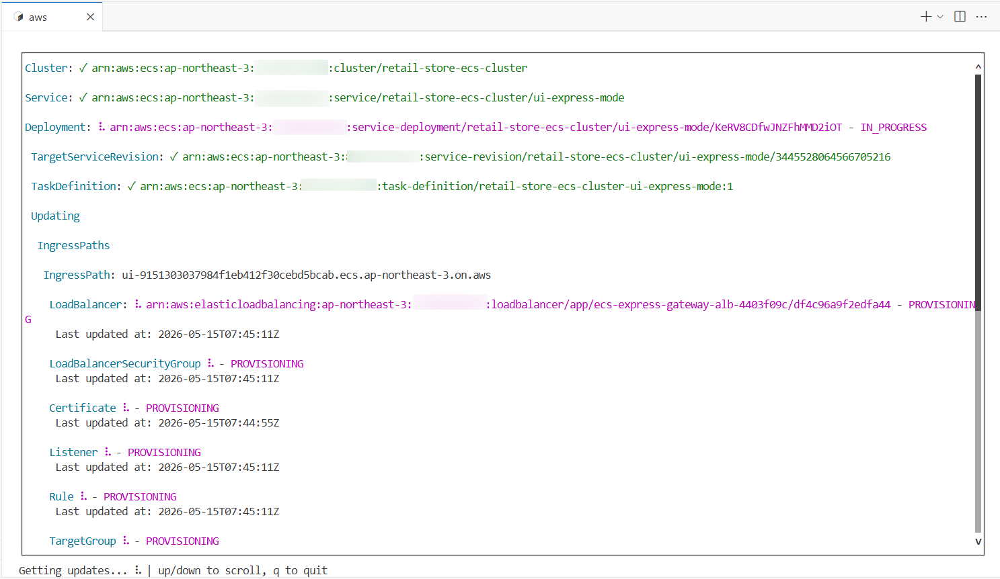
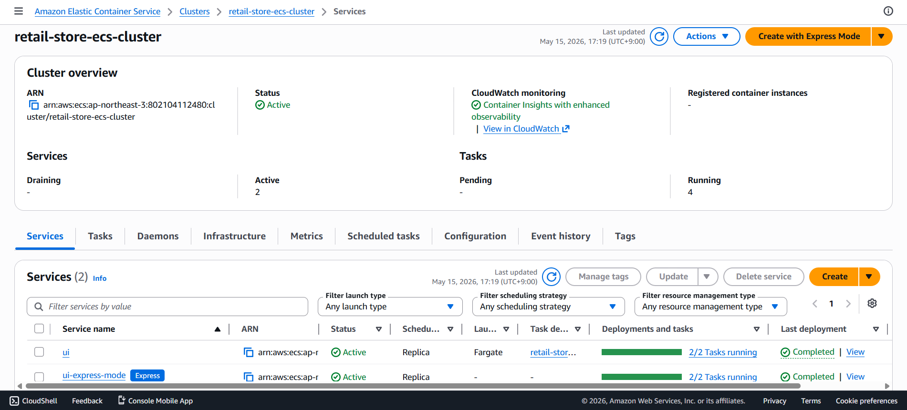

> **작성일:** 2026-05-15 | **수정일:** 2026-05-15

이번 섹션에서는 Fundamentals 랩에서 배포한 UI 서비스를 ECS Express Mode를 사용해 배포합니다.

이전에도 언급하였듯이, ECS Express Mode 서비스는 메인 컨테이너(Primary Container) 이미지와 Task Execution Role, Infrastructure Role을 지정하면, 나머지 인프라는 AWS가 이에 맞추어 자동으로 인프라를 설정하고 배포해줍니다.

다음은 ECS Express Mode 서비스를 생성하는 명령어(`aws ecs create-express-gateway-service`)의 옵션들을 필수 옵션과 선택 옵션으로 분류해 놓은 표입니다. `primary-container`, `execution-role-arn`, `infrastructure-role-arn`이 필수 옵션인 것을 알 수 있습니다.

| Parameter | Required | Description |
|---|---|---|
| `execution-role-arn` | yes | The IAM role for task execution. |
| `infrastructure-role-arn` | yes | The IAM role for managing infrastructure. |
| `primary-container` | yes | Defines the main container image and port. |
| `cluster`, `service-name` | no | The ECS cluster name and the name of the Express service. |
| `cpu`, `memory` | no | The allocated resources for your service. |
| `health-check-path` | no | Defines the endpoint for health checks. |
| `network-configuration` | no | This specifies the VPC subnets and security groups for the tasks. |
| `scaling-target` | no | Defines how the service automatically adjusts the number of running tasks based on demand. |
| `monitor-resources` | no | Enables monitoring resource status during create, update, and delete actions. |

---

다음 명령어를 실행하여 ECS Express Mode 서비스를 생성합니다.

```bash
aws ecs create-express-gateway-service \
    --execution-role-arn arn:aws:iam::${ACCOUNT_ID}:role/retailStoreEcsTaskExecutionRole \
    --infrastructure-role-arn arn:aws:iam::${ACCOUNT_ID}:role/ecsExpressInfrastructureRole \
    --service-name ui-express-mode \
    --cpu "1024" \
    --memory "2048" \
    --health-check-path "/actuator/health" \
    --cluster retail-store-ecs-cluster \
    --network-configuration '{
      "subnets": ["'$PUBLIC_SUBNET1'","'$PUBLIC_SUBNET2'"]
    }' \
    --scaling-target '{
        "minTaskCount": 2,
        "maxTaskCount": 5,
        "autoScalingMetric": "REQUEST_COUNT_PER_TARGET",
        "autoScalingTargetValue": 50
    }' \
    --primary-container '{
        "image": "public.ecr.aws/aws-containers/retail-store-sample-ui:1.2.3",
        "containerPort": 8080
    }' --monitor-resources
```

이 명령어의 출력입니다. ECS Express Mode 서비스 배포에 필요한 리소스들이 생성되고 있는 상태를 보여줍니다. 



---

AWS 콘솔의 ECS Clusters 에서 ECS Express Mode로 배포한 `ui-express-mode` 서비스를 확인할 수 있습니다.



---

다음 명령어를 실행하여 `ui-express-mode` 서비스에서 사용하는 로드 밸런서의 URL을 가져옵니다.

```bash
echo_g "Waiting for service to stabilize..."

aws ecs wait services-stable --cluster retail-store-ecs-cluster --services ui-express-mode

ECS_ALB_DNS=$(aws ecs describe-express-gateway-service \
  --service-arn arn:aws:ecs:${AWS_REGION}:${ACCOUNT_ID}:service/retail-store-ecs-cluster/ui-express-mode \
  --query service.activeConfigurations[0].ingressPaths[0].endpoint \
  --output text)

echo_c "https://${ECS_ALB_DNS}"
```

이 명령어의 출력입니다. 

```bash
Waiting for service to stabilize...
https://ui-9151303037984f1eb412f30cebd5bcab.ecs.ap-northeast-3.on.aws
```

이 주소를 브라우저의 주소창에 입력한 후 접속하면, 아래의 화면이 나옵니다.


