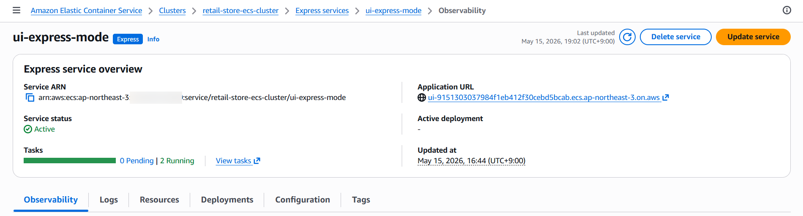
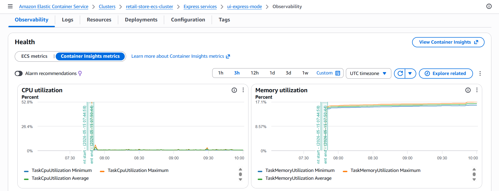
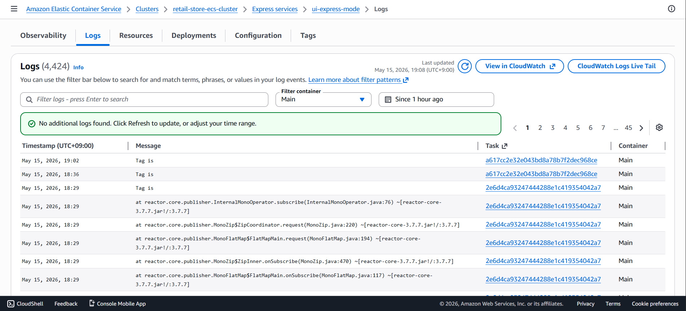
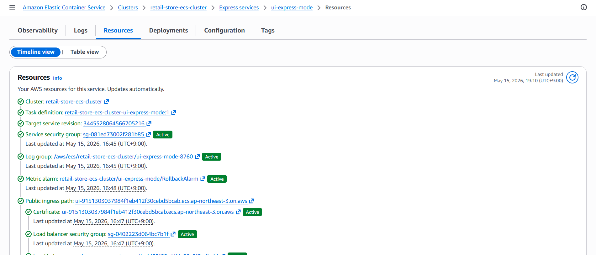
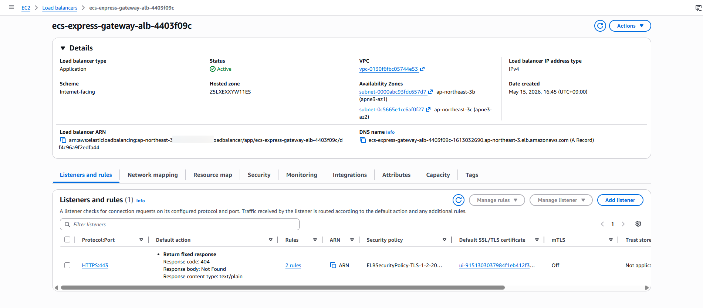

> **작성일:** 2026-05-15 | **수정일:** 2026-05-15

이번 섹션에서는 ECS Express Mode를 사용해 생성한 `ui-express-mode` 서비스를 리뷰합니다.

---

다음 스크린샷은 서비스 개요 페이지를 보여줍니다. 이 페이지에서 서비스 상태, 실행 중인 태스크, 배포 진행 상황을 모니터링할 수 있습니다. 배포된 애플리케이션에 접근할 때 사용할 수 있는 애플리케이션 URL을 확인합니다.



애플리케이션을 모니터링하려면 `Observability` 탭과 `Logs` 탭에서 `ui-express-mode` 서비스의 메트릭을 확인할 수 있습니다.



아래에서는 애플리케이션 로그를 볼 수 있습니다. 여기서 특정 메시지를 필터링하고 애플리케이션 동작을 실시간으로 모니터링할 수 있습니다.



Resources 탭에서는 Express Mode가 자동으로 프로비저닝한 모든 AWS 리소스의 개요를 확인할 수 있습니다. 이 스크린샷은 보안 그룹, 로드 밸런서, 대상 그룹을 포함하여 자동으로 생성되고 관리되는 인프라 구성 요소의 전체 목록을 보여줍니다.



다음 명령어를 실행하여 `ui-express-mode` 서비스의 최신 리비전에 대한 ECS Express Mode 구성을 확인합니다.

```bash
SERVICE_REVISION_ARN=$(aws ecs list-service-deployments \
  --service arn:aws:ecs:${AWS_REGION}:${ACCOUNT_ID}:service/retail-store-ecs-cluster/ui-express-mode \
  --max-results 1 \
  --query serviceDeployments[0].targetServiceRevisionArn \
  --output text)

aws ecs describe-service-revisions \
  --service-revision-arn $SERVICE_REVISION_ARN
```

서비스 생성 중에 Express Mode는 애플리케이션에 필요한 Task Definition을 생성했습니다. 다음 명령어를 사용하여 사용 가능한 Task Definition 목록을 확인할 수 있습니다.

```bash
aws ecs list-task-definitions --family-prefix retail-store-ecs-cluster-ui-express-mode --sort DESC --max-items 2
```

Load Balancer 콘솔 페이지를 열고 `ecs-express-gateway-alb-XXXXXXXX`라는 이름의 로드 밸런서를 클릭하여 생성된 Load Balancer의 구성 세부 정보를 확인합니다.


