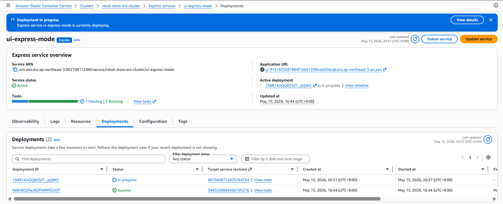
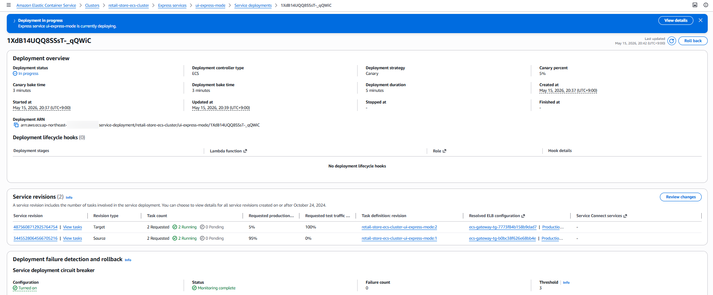
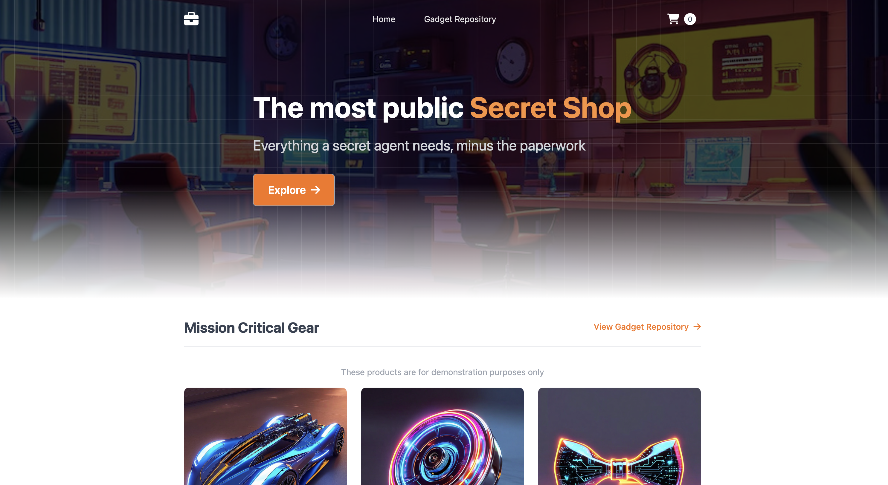

> **작성일:** 2026-05-15 | **수정일:** 2026-05-15

이번 섹션에서는 ECS Express Mode를 사용해 생성한 `ui-express-mode` 서비스의 UI를 오렌지색 테마로 업데이트합니다.

---

다음 명령어를 실행하여 `ui-express-mode` 서비스의 UI를 오렌지색 테마로 업데이트합니다.

```bash
aws ecs update-express-gateway-service \
    --service-arn arn:aws:ecs:${AWS_REGION}:${ACCOUNT_ID}:service/retail-store-ecs-cluster/ui-express-mode \
    --primary-container '{
        "image": "public.ecr.aws/aws-containers/retail-store-sample-ui:1.2.3",
        "environment": [{
          "name": "RETAIL_UI_THEME",
          "value": "orange"
        }]
    }'
```

---

Amazon ECS 콘솔에서 `ui-express-mode` 서비스의 배포 과정을 살펴보겠습니다. Deployment 탭을 보면 `in progress` 표시가 된 배포 중인 서비스를 확인할 수 있습니다.



Amazon ECS Express Mode는 ECS의 Canary 배포 전략을 사용합니다. Canary 배포는 먼저 초기 테스트를 위해 트래픽의 일부만 새 리비전으로 라우팅한 다음, Canary 단계가 성공적으로 완료되면 나머지 트래픽을 한 번에 새 리비전으로 전환합니다. 



---

다음 명령어를 실행하여 ECS 서비스가 안정화되면 주황색 테마가 적용된 업데이트된 버전의 애플리케이션을 확인합니다.

```bash
echo_g "Waiting for service to stabilize..."

aws ecs wait services-stable --cluster retail-store-ecs-cluster --services ui-express-mode

ECS_ALB_DNS=$(aws ecs describe-express-gateway-service \
  --service-arn arn:aws:ecs:${AWS_REGION}:${ACCOUNT_ID}:service/retail-store-ecs-cluster/ui-express-mode \
  --query service.activeConfigurations[0].ingressPaths[0].endpoint \
  --output text)

echo_c "https://${ECS_ALB_DNS}"
```


