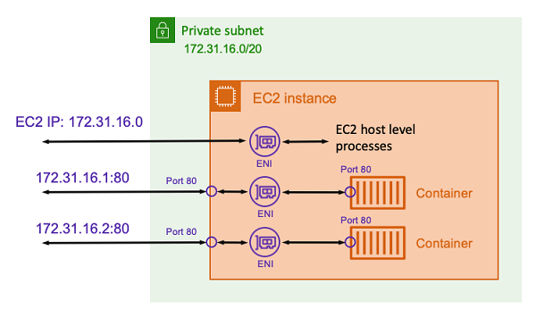

> **작성일:** 2026-05-10 | **수정일:** 2026-05-10

컨테이너를 실행할 때, 네트워크 설정은 중요합니다. 이번 섹션에서는 Amazon ECS의 Fargate 실행 타입에서 사용하는 `awsvpc` 네트워크 모드에 대한 개요를 제공합니다.

`awsvpc` 네트워크 모드에서 ECS는 Elastic Network Interface(ENI)를 각 태스크에 생성하고 관리합니다. 그리고 각 태스크는 자신만의 고유한 Private IP 주소를 할당받습니다. 따라서 이 네트워크 설정은 태스크와 서비스 간의 통신을 세밀하게 조정할 수 있습니다. 이 네트워크 모드는 ECS on EC2와 ECS on Fargate에서 모두 지원합니다. ECS on Fargate의 경우 이 네트워크 모드만 지원합니다.



위 다이어그램은 `awsvpc` 모드의 구조를 표현한 다이어그램입니다.

각 태스크가 ENI를 가지고, ENI가 고유한 Private IP 주소를 가지기 때문에, ECS 컨테이너 인스턴스의 IP 주소를 통해 통신하는 것이 아니라 각 태스크에 할당된 ENI의 Private IP를 통해 통신할 수 있습니다.

위 다이어그램에서 `EC2 IP: 172.31.16.0` <--> `ENI` <--> `EC2 host level processes`가 의미하는 것은, EC2 인스턴스의 ENI에 할당된 IP 주소를 EC2 호스트 레벨 프로세스가 사용한다는 것입니다. EC2 호스트 레벨 프로세스는 ECS Agent, container runtime, 로그/모니터링 에이전트 등이 있습니다. 이 EC2 호스트 레벨 프로세스들이 AWS API를 호출하거나 패키지를 다운받거나 인터넷과 통신할 때 EC2 인스턴스의 IP 주소를 사용합니다.

---

다음 명령어를 실행하면 UI 서비스의 실행 중인 태스크의 정보를 볼 수 있습니다

```bash
aws ecs describe-tasks \
 --cluster retail-store-ecs-cluster \
 --tasks $(aws ecs list-tasks --cluster retail-store-ecs-cluster --service ui --query 'taskArns[0]' --output text)
```

이 명령어의 출력입니다.

```json
{
    "tasks": [
        {
            "attachments": [
                {
                    "id": "464044b3-626f-44da-86ec-fa20a064d408",
                    "type": "ElasticNetworkInterface",
                    "status": "ATTACHED",
                    "details": [
                        {
                            "name": "subnetId",
                            "value": "subnet-08c4050330714ed3d"
                        },
                        {
                            "name": "networkInterfaceId",
                            "value": "eni-0a6c55131166f85c8"
                        },
                        {
                            "name": "macAddress",
                            "value": "06:39:15:1c:ae:1f"
                        },
                        {
                            "name": "privateDnsName",
                            "value": "ip-10-0-4-128.us-west-2.compute.internal"
                        },
                        {
                            "name": "privateIPv4Address",
                            "value": "10.0.4.128"
                        }
                    ]
                }
            ],
            "attributes": [
                {
                    "name": "ecs.cpu-architecture",
                    "value": "x86_64"
                }
            ],
            "availabilityZone": "us-west-2b",
            "clusterArn": "arn:aws:ecs:us-west-2:XXXXXXXXXX:cluster/retail-store-ecs-cluster",
            "connectivity": "CONNECTED",
            "connectivityAt": "2024-04-10T08:09:33.968000+00:00",
            "containers": [
                {
                    "containerArn": "arn:aws:ecs:us-west-2:XXXXXXXXXX:container/retail-store-ecs-cluster/70137dd0c1d14cf982e5a6b7446c5f54/db0fa651-1727-4215-b5a5-8a5577120942",
                    "taskArn": "arn:aws:ecs:us-west-2:XXXXXXXXXX:task/retail-store-ecs-cluster/70137dd0c1d14cf982e5a6b7446c5f54",
                    "name": "application",
                    "image": "public.ecr.aws/aws-containers/retail-store-sample-ui:1.2.3",
                    "imageDigest": "sha256:6316a3c331c39c35798f3b1303f80494526c0a879fe5a3db3b0b9a85c22aab36",
                    "runtimeId": "70137dd0c1d14cf982e5a6b7446c5f54-524788293",
                    "lastStatus": "RUNNING",
                    "networkBindings": [],
                    "networkInterfaces": [
                        {
                            "attachmentId": "464044b3-626f-44da-86ec-fa20a064d408",
                            "privateIpv4Address": "10.0.4.128"
                        }
                    ],
                    "healthStatus": "HEALTHY",
                    "cpu": "0"
                }
            ],
            "cpu": "1024",
            "createdAt": "2024-04-10T08:09:29.943000+00:00",
            "desiredStatus": "RUNNING",
            "enableExecuteCommand": false,
            "group": "service:ui",
            "healthStatus": "HEALTHY",
            "lastStatus": "RUNNING",
            "launchType": "FARGATE",
            "memory": "2048",
            "overrides": {
                "containerOverrides": [
                    {
                        "name": "application"
                    }
                ],
                "inferenceAcceleratorOverrides": []
            },
            "platformVersion": "1.4.0",
            "platformFamily": "Linux",
            "pullStartedAt": "2024-04-10T08:09:44.535000+00:00",
            "pullStoppedAt": "2024-04-10T08:09:52.398000+00:00",
            "startedAt": "2024-04-10T08:10:44.148000+00:00",
            "startedBy": "ecs-svc/8962710467093341990",
            "tags": [],
            "taskArn": "arn:aws:ecs:us-west-2:XXXXXXXXXX:task/retail-store-ecs-cluster/70137dd0c1d14cf982e5a6b7446c5f54",
            "taskDefinitionArn": "arn:aws:ecs:us-west-2:XXXXXXXXXX:task-definition/retail-store-ecs-ui:8",
            "version": 4,
            "ephemeralStorage": {
                "sizeInGiB": 20
            }
        }
    ],
    "failures": []
}
```

`attachments`는 태스크에 연결되어 있는 외부 리소스를 의미합니다. `"type": "ElasticNetworkInterface"`이기 때문에 이 리소스는 ENI를 의미합니다.

`"containers"` 필드의 `"networkInterfaces"` 값은 이 ENI의 `attachmentId` 값과 `privateIpv4Address` 값을 보여줍니다.

위 정보는 AWS 콘솔의 Amazon Elastic Container Service에서 Clusters → retail-store-ecs-cluster → Tasks에서 실행 중인 Task를 선택하면 볼 수 있습니다.
